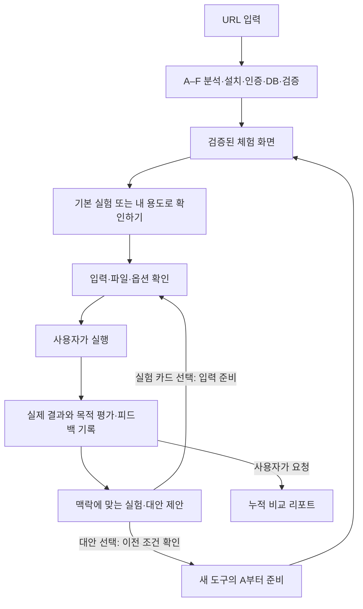

# URL to Playground — 맥락 기반 실험·비교 기능 확장 상세기획

작성일: 2026-09-19  
상태: 로컬 MVP 구현 반영. 아래 구현 대응표와 README의 검증 범위가 현재 지원 상태다.  
기본 기획: [PLAN.md](PLAN.md) · 현재 구현 범위: [README.md](README.md)

### 구현 대응표 · 2026-09-19

| 요구사항 | 코드 반영 | 현재 경계 |
| --- | --- | --- |
| 1. URL 체험 준비 | 기존 A–F·검증된 버전 조건 유지, READY 이후 공통 폼을 실험 기록에 연결 | 실제 Daytona 기능 호출까지 검증. 내부 브라우저 + 외부 프리뷰 분리 검증으로 수정. 원격 재검증은 예산 승인 대기 |
| 2. 맥락 실험 | 목적·조건·피드백 버전, 문서의 실제 입력만 제안, 선택과 실행 분리 | 구조화된 최근 관련 기록·결과 일부만 모델에 전달 |
| 3. 평가·대안 | 결정적 출력 검사와 사용자 판정 분리, 출처 인용·미검증 표시 | 공개 GitHub 최대 3개 탐색 또는 입력한 공식 문서 검토. 범용 웹 검색 제외 |
| 4. 대안 재체험 | 사용자 클릭 시 새 작업·환경, 동일 평가 프로젝트, 입력 대응표와 전송 확인 | 인증 키는 이어받지 않음. 원래 UI 조작·결과는 사용자 등록 |
| 5. 누적 메모리 | SQLite 구조화 기록, 실행 중복 방지, 암호화 파일 별도 만료·삭제 | 기록 30일, 파일 24시간/선택 시 7일, 파일당 1MB·총 20MB·20개로 확정 |
| 6. 실행 레시피 | 실제 명령 원장·종료 코드·설치 버전·업로드 파일·검증 근거, 복사·다운로드 | 원장 도입 전 명령은 추정하지 않음. 새 환경 재현은 별도 검증 |
| 7. 비교 리포트 | 고정 기록 스냅샷, 조건 차이·실측 범위·선택 근거·레시피, 선택적 모델 해석 | Markdown 지원으로 확정. PDF·Word 후속 범위 |
| 8. 비용 관리 | 준비·추가 분석·리포트가 부모 및 기존 일일 원장 공유, 일반 조작 모델 미호출 | 부모 $5, 분석 6회/$1, 모델 리포트 누적 $0.50, 준비 3개·본 실험 30회 |

회귀 테스트 52개와 문법 검사 통과. 분리된 브라우저 fixture에서 목적→실험→피드백→후속 실험→리포트 다운로드를 확인했다. 파일 보관·비용의 상세 구현값과 외부 연결의 남은 검증은 README를 따른다. 이하 문서는 확장 목표와 상세 설계를 보존하며 초기 제안값과 구현값이 다르면 이 표와 README를 우선한다.

## 1. 확장 목표와 문서 적용 범위

**API 문서나 GitHub URL을 실제 체험 화면으로 만들고, 사용자가 자신의 목적에 맞춰 실험을 이어가며 도구를 선택할 수 있게 한다.**

첫 실행 이후에도 목적·입력·결과·피드백을 이어받아 다음 실험을 제안한다. 현재 도구의 한계가 확인되면 근거 있는 대안을 제시하고, 사용자가 선택한 대안만 새 환경에서 준비한다. 누적 결과는 재현 가능한 실행 레시피와 비교 리포트로 남긴다.

핵심 가치는 추천 카드의 개수가 아니라 **무엇을 확인했고, 무엇이 부족하며, 다음에 왜 이 실험을 해야 하는지 설명하는 것**이다.

### 1.1 기존 기획과의 관계

| 구분 | 적용 기준 |
| --- | --- |
| URL 분석, A–F 준비·검증, 인증, DB, 체험 UI | 기존 PLAN의 원칙을 유지한다. |
| 실험 제안, 목적 평가, 대안 추천, 기록·레시피·리포트 | 이 문서를 확장 기준으로 적용한다. |
| 기존 PLAN의 추천 시스템 제외 | API 응답으로 별도 서비스를 만드는 것은 계속 제외한다. 사용자의 도구 평가를 돕는 실험·대안 추천은 이번 확장에 포함한다. |
| 기존 작업 종료 시 파일 폐기 | 샌드박스의 임시 파일은 폐기한다. 보관 대상으로 명시한 실험 기록·산출물은 별도 저장소에서 이 문서의 보관 정책을 따른다. |
| READY 이후 모델 호출 종료 | 준비 에이전트 반복은 종료한다. 목적 분석·후속 실험·대안 탐색·리포트는 별도 예산 작업으로만 실행한다. |
| 상충하는 내용 | 위 확장 사항은 이 문서를 우선한다. 그 외 실행·보안·예산 경계는 기존 PLAN을 따른다. |

요구사항에 명시된 사용자 흐름은 확정 원칙이다. 아래 보관 일수·추가 예산·개수 제한은 **초기 제안값**이며 구현 시 정책 설정으로 확정한다. 모델 이름·에이전트 프로세스 수·PDF/Word 지원 여부는 이 문서에서 확정하지 않는다.

### 1.2 제품 경계

- 기존 UI가 있으면 재사용한다. UI가 없을 때만 입력 폼과 결과 뷰어를 구성한다.
- 체험과 비교에 필요한 기능을 제공하며, API를 소재로 별도의 완성형 서비스를 생성하지 않는다.
- 서비스 실행 성공을 사용자 목적 달성으로 취급하지 않는다.
- 실험이나 대안의 실제 실행은 사용자가 시작한다. 만족할 때까지 에이전트가 서비스를 연쇄 실행하지 않는다.
- 현재 지원하지 않는 런타임·인증·네트워크 요구를 추천 기능이 우회하지 않는다.
- 공개 배포용 다중 사용자 인증·저장소 권한 체계는 현재 로컬 MVP와 구분해 구현해야 한다.

## 2. 핵심 개념과 기록 단위

사용자에게는 **평가 프로젝트**라는 이름으로 같은 목적의 체험을 묶어 보여준다. 이것은 기존 앱의 준비 작업보다 상위 개념이다.

| 개념 | 의미 | 구분해야 할 점 |
| --- | --- | --- |
| 평가 프로젝트 `EvaluationSession` | 하나의 목적과 기대 조건을 중심으로 이어지는 기록 | 여러 도구와 여러 샌드박스를 포함할 수 있다. |
| 목적 버전 `GoalVersion` | 목적·필수 조건·선호 조건의 특정 시점 | 목적 변경으로 이전 평가 기준을 덮어쓰지 않는다. |
| 도구 체험 `ToolTrial` | 특정 URL·기능·버전을 평가하는 대상 | 같은 도구라도 기능·버전이 바뀌면 차이를 기록한다. |
| 준비 작업 `PreparationJob` | A–F가 환경을 만들고 검증하는 기존 작업 | 샌드박스의 수명과 비용을 관리한다. 재생성도 새 작업이다. |
| 실험 `Experiment` | 입력·파일·옵션·확인할 조건을 정한 실행 계획 | 카드를 선택한 상태와 실제 실행 결과를 구분한다. |
| 실행 기록 `ExperimentRun` | 사용자가 시작한 실제 실행 1회 | 다시 실행하면 새 기록을 만든다. 준비 과정의 B/E 검증과 구분한다. |
| 평가·피드백 | 실행 증거, 목적 충족 판단, 사용자의 의견 | 측정 결과와 주관적 의견을 각각 보존한다. |
| 제안 `Suggestion` | 특정 기록을 근거로 만든 다음 실험 또는 대안 | 근거 기록·목적 버전·변경점을 가진다. |
| 전환 `ToolTransition` | 기존 도구에서 새 도구로 옮긴 이유와 조건 연결 | 동일하지 않은 옵션·입력을 표시한다. |
| 실행 레시피·리포트 | 확인된 명령과 누적 비교의 특정 시점 산출물 | 생성 시점과 근거 기록을 고정한다. |

관계는 `평가 프로젝트 → 도구 체험 → 준비 작업 / 실험 → 실행 기록 → 평가·피드백`이다. 제안은 이전 실행을 참조하고, 선택된 제안이 다음 실험이나 도구 체험으로 연결된다. 여러 번의 준비 작업이 하나의 도구 체험에 연결될 수 있지만, 각 실행은 사용한 준비 작업과 버전을 정확히 참조한다.

목적이 없는 최초 체험은 기본 기능 확인으로 기록한다. 나중에 **내 용도로 확인하기**에서 목적을 설정해도 이전 실행의 입력과 결과는 이어받되, 새 목적에 대한 충족 여부는 아직 평가하지 않은 상태에서 시작한다.

## 3. 전체 사용자 흐름

### 3.1 URL 입력과 준비

1. URL 제출 시 평가 프로젝트와 첫 도구 체험을 연결한다. 목적 입력은 필수가 아니다.
2. 기존 A–F 흐름으로 분석·설치·인증·DB·기능·브라우저 검증을 수행한다.
3. A 분석 전에는 불확정 진행 표시, 분석 후에는 실제 필수 단계 수에 따른 진행 바를 제공한다.
4. 최종 제공 버전이 기능 검증과 브라우저 검증을 통과한 경우에만 READY로 표시한다.
5. 검증한 기능·예제 입력·버전·검증 시각과 아직 확인하지 않은 범위를 함께 제공한다.

대표 기능 검증은 모든 입력에서의 성공 보장이 아니다. 이후 사용자 입력이 실패해도 준비 검증 기록을 조작하지 않고 별도 실행 실패로 남긴다.

### 3.2 체험 화면 구성

| 영역 | 표시 내용 | 주요 동작 |
| --- | --- | --- |
| 목적 요약 | 현재 목적, 기대 조건, 아직 미정인 조건 | 내 용도로 확인하기 / 목적 수정 |
| 도구 상태 | URL·기능·버전, 검증 범위, 환경 만료 시각 | 준비 내역 / 다시 준비 |
| 체험 | 원래 UI 또는 입력 폼·결과 뷰어 | 입력·파일·옵션 변경 / 실행 |
| 결과 평가 | 실제 출력, 실행 상태, 목적 조건별 확인 결과 | 만족 / 일부 아쉬움 / 불만족 / 판단 보류 |
| 다음 실험 | 제안 이유·변경점·확인할 조건 | 이 조건 준비하기 |
| 대안 | 확인된 한계, 추천 근거, 미검증 내용 | 해당 서비스로 실행해보기 |
| 누적 기록 | 도구별 타임라인, 조건 차이, 결과·피드백 | 이전 결과 비교 / 레시피 / 비교 리포트 |

핵심 결과를 먼저 보여주고 원본·로그·설치 상세는 접어서 제공한다. 기존 UI는 그대로 체험 영역에 둔다. 제어 페이지의 목적·평가·기록 영역을 위해 원본 UI를 다시 만들지 않는다.

### 3.3 사용자 실행 경계

- 일반 실험 카드 선택은 입력과 옵션만 준비한다. 화면에 변경점을 보여준 다음 별도 실행 버튼을 누르게 한다.
- 대안 카드의 **해당 서비스로 실행해보기**는 새 도구의 준비 작업을 시작한다. 준비 과정의 제한된 B/E 검증 호출은 기존 준비 작업에 포함된다.
- 대안의 준비 완료만으로 이전 본 실험을 자동 실행하지 않는다. 사용자가 이어받은 조건을 확인하고 시작한다.
- 선택한 파일을 새 외부 제공사에 보내야 하면 전송 대상·파일 범위를 먼저 표시한다. 그 전에는 해당 파일을 사용하는 검증도 수행하지 않는다.
- 비용·인증·입력이 부족하면 해당 단계에서 대기한다. 다른 서비스를 자동으로 대신 실행하지 않는다.

## 4. 목적과 기대 조건 설정

**내 용도로 확인하기**에서 다음을 짧게 받는다. 모든 필드를 의무화하지 않는다.

| 입력 | 예시 | 처리 |
| --- | --- | --- |
| 확인하려는 목적 | 스캔된 계약서에서 표를 추출하고 싶다 | 원문과 구조화된 목적을 함께 보존 |
| 주요 입력 | 사용자가 선택한 테스트 문서 | 현재 입력을 후보로 제시하고 선택 상태 확인 |
| 필수 기대 조건 | 행·열 경계 유지, 병합 셀 유지 | 각각 별도 조건 ID 부여 |
| 선호 조건 | 설치가 간단함, 빠른 응답 | 필수 조건과 구분 |
| 판단 방법 | 정답 파일 비교 / 직접 보고 판단 | 자동 평가 가능한 범위 표시 |
| 제한 | 외부 업로드 불가, 키 없는 도구 선호 | 후보·실행의 필터로 적용 |

‘정확하게’, ‘빠르게’ 같은 표현만 있으면 임의의 숫자로 바꾸지 않는다. 필요한 경우 기준을 한 번 제안하고, 기준이 정해지지 않으면 사용자 판단 항목으로 남긴다. 목적 저장 후 분석할 때만 모델을 호출하며, 입력하는 글자마다 호출하지 않는다.

목적 수정은 새 버전으로 저장한다. 기존 결과를 새 조건으로 다시 평가할 경우 별도 평가 기록을 만들며 실제 재실행 여부를 표시한다. 관련 없는 새 목적이면 별도 평가 프로젝트를 만들고, 이전 결과를 참고자료로 연결할 수 있다.

## 5. 맥락을 이어가는 실험 제안

### 5.1 제안에 필요한 맥락

현재 목적·기대 조건, 선택한 입력과 파일, 적용 옵션, 관련 실행 결과, 사용자 피드백, 확인한 조건과 미확인 조건을 구조화해 사용한다. 최신 결과 하나만 보거나 전체 채팅을 그대로 보내는 방식은 사용하지 않는다.

### 5.2 제안 유형과 선택 원칙

| 유형 | 조건 | 제안 내용 |
| --- | --- | --- |
| 결과 개선 | 현재 결과에서 구체적인 부족함이 확인됨 | 같은 입력에서 문서화된 관련 옵션을 바꿔 개선 확인 |
| 관련 조건 탐색 | 기본 조건에 만족했거나 핵심 조건을 이미 확인함 | 같은 목적의 다른 입력 특성·예외 조건 확인 |
| 대안 체험 | 현재 도구의 한계 또는 사용자 제약과의 불일치가 확인됨 | 근거가 있는 다른 도구 제안 |
| 판단 보완 | 기대 조건·결과·사용자 의견이 부족함 | 필요한 피드백이나 기준 요청. 무관한 실험으로 대체하지 않음 |

가능하면 한 번에 핵심 변수 하나를 바꾼다. 여러 변수를 바꿔야 하면 변경점을 모두 표시하고 무엇 때문에 좋아졌는지 단정하지 않는다. 기능적 한계와 설치 실패·인증 실패·잘못된 입력은 구분한다. 네트워크 오류 하나로 도구 품질이 낮다고 결론 내리지 않는다.

### 5.3 카드의 필수 정보

| 필드 | 내용 |
| --- | --- |
| 제목과 유형 | 사용자가 이해할 수 있는 실험명, 개선/조건 탐색 |
| 제안 이유 | 어떤 결과·피드백·미확인 조건 때문에 제안했는지 |
| 기준 실험 | 비교할 이전 실행 ID와 목적 버전 |
| 달라지는 점 | 입력·파일·옵션의 이전 값 → 제안 값 |
| 유지되는 점 | 같은 파일·기능 등 비교를 위해 유지할 조건 |
| 확인할 조건 | 결과에서 무엇을 확인할지, 판단 방법 |
| 실행 조건 | 추가 입력·키·준비 작업·외부 호출 필요 여부 |
| 근거·미확인 사항 | 옵션 문서 또는 실행 증거, 아직 시험하지 않은 효과 |

옵션은 확인된 스키마·공식 문서 범위에서만 제안한다. 존재하지 않는 옵션을 실행 코드에 전달하지 않는다. 선택 시 필드 타입·범위·현재 기능 버전을 코드로 검증한다. 새 코드나 의존성이 필요한 실험은 ‘설정 변경’으로 숨기지 않고 별도 준비·재검증 작업으로 표시한다.

### 5.4 반복 제안과 낡은 카드 방지

- 한 번에 후속 카드 최대 3개를 제안한다. 근거가 부족하면 더 적게 제안하거나 제안하지 않는다.
- 최초 목적 저장, 새 실행의 결과·피드백 확정, 사용자의 명시적 재분석 요청만 분석 시작점으로 삼는다.
- 결과 직후에는 코드로 상태와 피드백 UI를 표시한다. **피드백 저장 후 다음 제안 보기** 또는 **피드백 없이 다음 제안 보기**에서 한 묶음의 분석을 시작해 중복 호출을 줄인다.
- 같은 목적 버전·관련 실행·피드백 버전·분석 유형의 요청은 기존 결과를 반환한다.
- 동일한 입력·옵션·확인 조건의 제안을 반복 생성하지 않는다. 사용자가 직접 재실행한 경우에는 반복 측정으로 기록한다.
- 카드 생성 후 목적·파일·기능이 바뀌면 오래된 카드로 표시한다. 이전 값을 현재 입력에 조용히 덮어쓰지 않는다.
- 한도를 소진하면 기록과 직접 실행은 남겨두고 추가 분석을 멈춘다. 실패 안내를 작성하려고 모델을 다시 호출하지 않는다.

### 5.5 계약서 표 추출 예시

아래는 흐름 설명용 가상 상황이며 특정 서비스에서 측정한 결과가 아니다.

| 이전 상황 | 다음 제안 | 고정·변경 조건 | 확인할 점 |
| --- | --- | --- | --- |
| 표 경계 일부 누락 | 지원되는 표 경계 옵션 변경 | 같은 문서 유지, 관련 옵션만 변경 | 누락된 경계 개선과 다른 셀 손상 여부 |
| 기본 추출에 만족 | 여러 페이지에 걸친 표 확인 | 다중 페이지 테스트 파일 선택 | 페이지 사이 행·열 연결 유지 |
| 기본 추출에 만족 | 병합 셀이 있는 표 확인 | 병합 셀을 포함한 파일 선택 | 셀 결합 관계 보존 |
| 병합 셀 미지원이 문서·결과로 확인됨 | 관련 기능을 명시한 대안 도구 검토 | 목적·재사용 가능한 문서 유지 | 대안의 실제 병합 셀 처리 여부 |

새 예시 파일을 사용자 파일인 것처럼 만들지 않는다. 별도 샘플을 제공하면 출처와 예시 데이터임을 표시하고 기존 문서와 다른 조건으로 기록한다.

## 6. 결과 평가: 실행과 목적 충족의 분리

### 6.1 평가 축

| 평가 축 | 상태 | 근거 |
| --- | --- | --- |
| 실행 | 대기 / 실행 중 / 성공 / 실패 / 취소 / 결과 미확정 | 실제 실행기 응답, 오류, 종료 상태 |
| 목적 조건별 충족 | 충족 / 부분 충족 / 미충족 / 판단 불가 / 미확인 | 검사 결과, 비교 자료, 사용자 피드백 |
| 사용자 만족 | 만족 / 일부 아쉬움 / 불만족 / 판단 보류 | 사용자가 직접 선택한 의견 |

HTTP 성공이나 파일 생성은 실행 성공의 근거일 뿐 품질의 근거는 아니다. 실행에 성공했어도 표 경계가 누락될 수 있다. 반대로 사용자에게 유용했더라도 필수 조건의 실패 기록을 지우지 않는다.

전체 목적 상태는 명시적인 조건에서 계산한다. 모든 필수 조건이 확인되어 충족된 경우에만 전체 충족으로 표시한다. 미확인 필수 조건이 남아 있으면 ‘확인 필요’를 유지한다. 조건 간 가중치를 임의로 만들지 않는다.

### 6.2 근거의 종류

| 근거 | 표현 | 제한 |
| --- | --- | --- |
| 결정적 검사 | 해당 출력 필드·파일·assertion과 실제 판정 | 스키마 통과를 내용 정확도로 확대 해석하지 않음 |
| 정답 자료 비교 | 사용자가 지정한 정답과 비교한 결과 | 정답·분모·계산 방법이 없으면 정확도 %를 만들지 않음 |
| 사용자 평가 | 사용자가 확인한 항목과 의견 | 다른 사용자·다른 입력에도 같은 결과라고 일반화하지 않음 |
| 모델 해석 | 관찰된 출력에 대한 해석과 근거 참조 | 단독 해석은 객관적 검증 통과로 표시하지 않음 |
| 정보 부족 | 결과 미수집·기준 미정·파일 만료 등 | 부족한 사실을 추측으로 채우지 않음 |

사용자에게는 실패하거나 미확인인 조건을 중심으로 짧게 피드백을 요청한다. ‘아쉬운 부분’은 조건 선택과 자유 입력을 함께 제공한다. 피드백 변경은 이력으로 남기고, 모델과 의견이 달라도 사용자 의견을 임의로 수정하지 않는다.

### 6.3 실패 분류와 대응

입력 형식 오류는 입력 수정, 인증 오류는 인증 연결, 일시적 장애는 상태 안내, 지원하지 않는 기능은 한계 기록으로 연결한다. 원인이 불명확하면 불명확하다고 남긴다. 설치·어댑터·검증 코드의 문제를 서비스 자체의 품질 문제로 보고하지 않는다.

타임아웃으로 제공사 처리 여부를 알 수 없으면 결과 미확정으로 기록한다. 과금되거나 부작용이 있을 수 있는 요청을 자동 반복하지 않는다. 사용자가 다시 실행하더라도 중복 처리 가능성을 표시하고 기존 실행 기록을 보존한다.

## 7. 대안 탐색과 추천

### 7.1 탐색 시작과 후보 선정

목적·현재 한계·제약·이미 시험한 도구를 입력으로 탐색한다. 한계가 불명확하면 먼저 평가 근거를 보완한다. 사용자가 직접 입력한 다른 URL도 같은 목적의 후보로 연결할 수 있다.

후보 검토 순서는 목적에 필요한 기능 → 사용자 제약 → 현재 실행 지원 범위 → 인증·입력 호환성이다. 유명세나 검색 순위를 적합성 점수로 사용하지 않는다. 공식 문서·공식 저장소에서 기능 근거를 확인하고 URL·확인 시각·관련 버전을 기록한다.

모델이 기억하는 도구 이름만으로 링크나 지원 기능을 만들어 추천하지 않는다. 검색·문서 확인이 불가능하거나 적절한 후보가 없으면 ‘근거를 확인한 대안 없음’으로 표시한다. 대안 카드를 채우기 위해 탐색을 무한 반복하지 않는다.

### 7.2 대안 카드

공통 문구: **실험 결과가 원하는 수준에 미치지 못했나요? 이 도구는 어떤가요?**

| 항목 | 표시 내용 |
| --- | --- |
| 도구와 URL | 실제 확인한 공식 서비스·문서 또는 저장소 |
| 현재 도구의 한계 | 관련 실행·조건·사용자 피드백 링크 |
| 추천 이유 | 대안의 어떤 기능이 현재 목적에 관련되는지 |
| 근거 수준 | 공식 문서에서 확인 / 이 평가 프로젝트에서 직접 실행 확인 |
| 아직 미검증 | 해당 문서·파일에서의 실제 품질, 실행 시간 등 |
| 필요한 준비 | 인증, 지원 입력 형식, 런타임·DB, 확인된 사용 제약 |
| 이어받을 조건 | 목적·기대 조건·재사용 가능한 입력 요약 |
| 실행 버튼 | 해당 서비스로 실행해보기 |

문서에서 기능이 확인되었다는 이유로 ‘더 정확함’, ‘더 빠름’, ‘더 저렴함’을 단정하지 않는다. 가격을 확인하지 못한 도구는 비용 미확인으로 표시하며 유료 실행 허용으로 간주하지 않는다.

현재 실행기에서 지원하지 않는 후보는 제한 이유와 공식 링크를 보여줄 수 있지만 실행 가능한 카드와 구분한다. 외부 인증이 필요한 원본 저장소 등 현재 차단된 유형은 준비 버튼을 비활성화한다. 추천 기능 추가가 실행 지원 범위 확대를 뜻하지 않는다.

## 8. 대안 선택과 A부터 재체험

### 8.1 전환 절차

1. 사용자가 대안 버튼을 선택하면 현재 목적·조건·재사용 입력과 선택 근거를 전환 기록으로 고정한다.
2. 기존 예산 및 동시 준비 한도를 확인하고, 새 URL에 대해 새 준비 작업을 만든다. A부터 분석·검증하며 기존 도구의 READY를 상속하지 않는다.
3. A가 확인한 새 기능 스키마를 바탕으로 입력·옵션 대응표를 만든다.
4. 인증·추가 입력·외부 파일 전송 확인이 필요하면 해당 단계에서 대기한다. 검증용 공개 샘플과 사용자의 실제 파일을 구분한다.
5. 최종 기능·브라우저 검증을 통과하면 새 체험 화면과 조건 차이를 표시한다.
6. 사용자가 본 실험을 실행한다. 결과는 같은 평가 프로젝트의 새 실행으로 추가한다.

### 8.2 입력과 옵션 연결 규칙

| 연결 상태 | 예시 | 처리 |
| --- | --- | --- |
| 그대로 재사용 | 같은 PDF 파일, 같은 목표 조건 | 선택된 파일 ID·해시와 실제 접근 가능 여부 확인 |
| 동등한 변환 | 문서로 의미·단위가 확인된 옵션 명칭 변경 | 이전 값·새 값·변환 규칙 표시 |
| 부분 대응 | 같은 이름이지만 범위나 동작이 다름 | 차이를 표시하고 사용자 확인 필요 |
| 대응 없음 | 이전 도구에만 있는 옵션 | 지원하지 않음을 표시하고 조용히 삭제하지 않음 |
| 새 필수 값 | 새 도구가 요구하는 출력 언어·키 | 사용자 입력 대기 |
| 원본 만료 | 파일 메타데이터만 남음 | 재업로드 요청. 다른 파일이면 조건 변경 기록 |

API 키·세션 쿠키·서명 URL·DB 비밀번호는 전환 기록이나 모델 컨텍스트로 복사하지 않는다. 도구별 인증을 연결한다. 이전 서비스에 대한 파일 전송 동의가 새 제공사에도 자동 적용되는 것으로 취급하지 않는다.

새 도구의 샌드박스·DB·프로세스·비밀정보는 별도로 관리한다. 이전 환경을 공유하거나 DB를 그대로 연결하지 않는다. 재사용하는 데이터는 사용자가 선택한 테스트 입력과 명시적으로 내보낸 산출물뿐이다.

이전 환경이 살아 있으면 남은 시간 동안 돌아갈 수 있다. 동시 샌드박스 한도 때문에 새 준비가 불가능하면 종료할 환경을 선택하게 하고, 기록은 유지한다. 기록을 읽기 위해 환경을 자동 재생성하지 않는다.

## 9. 누적 실험 메모리와 결과 수집

### 9.1 저장할 구조

| 기록 | 주요 필드 |
| --- | --- |
| 평가 프로젝트 | ID, 소유자, 제목, 목적 버전, 생성·만료 시각, 정책 버전 |
| 목적 | 사용자 원문, 기대 조건 ID·필수 여부·판단 방법, 사용 제약 |
| 대상 | 도구 URL, 정규화된 공식 출처, 기능, 커밋·패키지·API 버전, 문서 확인 시점 |
| 실행 조건 | 준비 작업 ID, 환경·어댑터 버전, 입력 스냅샷, 파일 참조·해시, 옵션·기본값, DB 초기 상태 |
| 결과 | 출력·오류 참조, 실행 상태, 검증 증거, 측정 구간, 비용의 출처·확정 상태 |
| 평가 | 조건별 판단, 근거 유형·참조, 평가 버전, 사용자 피드백·수정 시점 |
| 연결 | 이전 실행 ID, 선택한 제안 ID, 이유, 변경점, 새롭게 확인한 조건 |
| 대안 전환 | 현재 한계, 후보 근거, 이전·새 옵션 대응, 파일 전송 확인 범위 |
| 실행 레시피 | 검증된 단계·환경변수 이름·의존성, 해결 내역, 근거 실행 ID |
| 리포트 | 포함 기록 ID와 버전, 형식, 생성 상태, 산출물 해시·보관 만료 |

실행 직전 조건을 불변 스냅샷으로 저장한다. 사용자가 폼을 바꿔도 이전 실행의 입력은 바뀌지 않는다. 피드백·평가·요약은 버전을 추가한다. API 버전을 확인하지 못하면 조회 날짜만으로 고정 버전이라고 표시하지 않는다.

### 9.2 기존 UI를 사용하는 경우의 수집 범위

원래 UI를 띄웠다는 사실만으로 모든 입력·출력·클릭을 자동 수집할 수 있다고 가정하지 않는다. 특히 별도 출처의 iframe과 자체 통신을 사용하는 앱은 수집 범위가 다르다.

| 수집 수준 | 가능한 기록 | 사용자 표시 |
| --- | --- | --- |
| 공통 폼·호출 어댑터 | 요청·응답·옵션·실행 시간·파일 참조 | 조건과 결과 자동 기록 |
| 검증된 기존 UI 연동 | 명시적으로 연결한 실행·출력·측정 이벤트 | 연동한 기능의 기록 범위 표시 |
| 연동되지 않은 기존 UI | 준비 검증 증거, 사용자가 등록한 출력·조건·피드백 | 일부 수동 기록, 미수집 항목 표시 |

B/E의 준비 검증에서 확인한 결과와 이후 사용자 실행을 혼동하지 않는다. 기존 UI의 모든 네트워크·키 입력을 무차별로 수집하지 않는다. 필요한 기능에 한해 인증된 결과 이벤트 또는 출력 내보내기 어댑터를 붙인다.

직접 결과를 등록한 경우 출처를 ‘사용자 등록’으로 남긴다. 화면 캡처만으로 구조화된 정답이나 정확한 실행 시간을 확보했다고 주장하지 않는다. 결과를 확보할 수 없는 도구는 체험 자체를 제공할 수 있어도 자동 비교 범위는 제한한다.

### 9.3 모델에 전달할 맥락

기본 검색 단위는 같은 소유자의 같은 평가 프로젝트다. 현재 목적과 제안의 기준 실행을 먼저 찾고, 관련된 최근 결과·피드백·확인 조건·실패 패턴·레시피 일부만 추가한다.

- 기본 묶음: 현재 목적, 기준 실행 1개, 관련 실행 최대 2개, 조건별 확인 현황, 필요한 문서 근거.
- 긴 출력은 구조화된 요약과 원본 참조를 전달한다. 결론마다 근거 ID를 유지한다.
- 요약이 오래되면 새 기록을 반영하되, 전체 대화를 다시 전달하지 않는다.
- 입력 한도를 넘으면 관련성이 낮은 과거 기록부터 제외하고 누락 범위를 표시한다. 중요한 근거까지 빠지면 판단을 보류한다.
- 원본 파일 전체를 자동으로 모델에 보내지 않는다. 필요한 부분의 전송 대상·범위를 정하고, 민감한 문서는 사용자의 선택에 따라 처리한다.
- 웹 문서·저장소·실험 출력 속 문장을 에이전트 지시로 취급하지 않는다. 기록은 작업 변경 권한을 가지지 않는다.

메모리 요약을 위해 백그라운드에서 모델을 반복 호출하지 않는다. 집계·필터·조건 상태 갱신은 코드로 수행하고, 서술 요약이 필요할 때만 분석 예산 안에서 생성한다.

## 10. 보관·만료·삭제 정책

아래는 초기 제안값이다. 샌드박스 수명과 기록·파일 수명을 분리하고 화면에 각 만료 시각을 표시한다.

| 대상 | 기본 보관 | 만료 후 동작 |
| --- | --- | --- |
| 실행 환경·임시 DB | 기존 정책: READY 후 60분, 사용자 입력 대기 30분 | 프로세스·샌드박스·프리뷰 접근 정리 |
| 작업 인증정보 | 해당 작업에 필요한 기간만 | 작업 종료·만료 시 폐기, 기록·레시피에서 제외 |
| 실험 메타데이터·텍스트 결과·평가·레시피 | 평가 프로젝트 생성 후 30일 | 해당 내용과 파생 요약 삭제 |
| 업로드 파일·대용량 출력·이미지 증거 | 파일 생성·업로드 후 24시간 | 원본 삭제, 기록에는 만료 사실과 비교 한계 표시 |
| 사용자가 보관 연장을 선택한 파일 | 해당 파일 생성 시점부터 최대 7일 | 자동 연장하지 않고 동일하게 삭제 |
| 생성 리포트 파일 | 생성 후 7일 또는 프로젝트 만료 중 빠른 시점 | 다운로드 만료, 모델 자동 재생성 없음 |
| 최소 비용 원장 | 90일 제안, 사용자 내용·키·원문 URL 없이 | 집계·정산에 필요한 최소 항목만 보관 후 삭제 |

프로젝트 삭제는 파일·결과·요약·리포트·검색 인덱스에 함께 적용한다. 비용 원장은 콘텐츠를 제거한 최소 정산 기록만 유지한다. 백업이 있다면 삭제 반영 기한도 운영 정책에 명시하며, 삭제된 데이터를 요약이나 복원 작업에서 되살리지 않는다.

작업 만료와 별도로 보관하도록 선택한 산출물은 종료 전에 안전한 저장소로 복사하고 무결성을 확인한다. 저장 실패는 샌드박스 정리를 무기한 막지 않으며 ‘기록 저장 실패’로 표시한다. 만료된 파일의 메타데이터만 남아 있는 경우 원본 다운로드나 동일 조건 재현을 보장하지 않는다.

파일 한도 초기 제안은 파일당 20 MiB, 프로젝트당 합계 100 MiB, 최대 20개다. 이는 현재 구현의 업로드 한도를 이미 확장했다는 뜻이 아니다. 문서·이미지 처리 지원 시 페이지 수·압축 해제 크기·CPU·메모리·시간 상한을 함께 검증한 후 활성화한다. 임시 DB 전체와 패키지 캐시는 기록 보관 대상에서 제외한다.

영속 저장소의 파일도 소유자 권한 검사를 적용한다. 비공개 파일을 공개 프리뷰 URL로 장기 보관하지 않으며, 다운로드 URL이 만료돼도 원본 보관 여부는 별도 정책으로 판단한다.

## 11. 검증된 실행 레시피

### 11.1 레시피에 포함할 내용

| 항목 | 포함 기준 |
| --- | --- |
| 대상과 환경 | 실제 커밋·패키지 버전, OS·런타임·작업 디렉터리·필요 자원 |
| 의존성 | 실제 설치한 버전과 잠금 파일, 확인 명령의 결과 |
| 설치·실행 | 실제 성공한 명령, 필요한 파일·패치와 적용 순서 |
| DB | 실제 수행한 마이그레이션·테스트 시드·연결 확인 방법 |
| 환경변수 | 이름·용도·필수 여부·설정 방법·공식 인증 경로 |
| 문제와 해결 | 관찰한 오류, 실제 적용한 수정, 해결을 확인한 증거 |
| 검증 | 확인한 기능·입력 예제·기대 출력 형태·B/E 결과·시점 |
| 범위와 한계 | 미검증 기능, 플랫폼 차이, 재실행 시 인증·파일 필요 여부 |

### 11.2 생성·검증 규칙

실행기에서 명령·종료 코드·설치 버전·패치·검증 결과를 구조화해 기록한다. 모델이 제안했지만 실행하지 않은 명령은 검증된 레시피에 들어가지 않는다. 성공한 명령이라도 최종 코드와 무관한 임시 시도는 설치 순서에서 제외하고 필요한 경우 해결 이력으로만 남긴다.

단순 종료 코드 0만으로 서비스 실행 성공을 판정하지 않는다. 실제 준비 완료 버전의 health 확인·기능 검증·브라우저 검증과 연결한다. 여러 수정 결과를 합쳐 새로운 명령을 추측해서 만들지 않으며, 필요한 생성 파일과 적용 패치도 함께 제공한다.

기본 정리는 명령 원장과 템플릿으로 수행한다. 설명을 모델로 다듬더라도 명령·버전·값을 추가하거나 수정하지 못하게 스키마와 근거 검사를 적용한다. 선택적인 설명 생성도 분석 예산에 포함한다.

비밀정보는 명령 원장을 저장하기 전부터 제거한다. 셸에 직접 포함된 키, 인증 헤더, 비밀번호, 서명 URL, 사용자 문서 내용은 내보내지 않는다. 환경변수는 이름과 자리표시자만 포함하며, 제공하는 예시 파일은 공개 가능하거나 사용자가 내보내기를 선택한 입력으로 제한한다.

### 11.3 화면과 다운로드

- ‘실행 레시피’에서 단계별 복사, 전체 Markdown 다운로드를 제공한다. 구조화 JSON 내보내기는 구현 선택 사항이다.
- 원래 실행 환경에서 성공했다는 사실과 새 환경에서 재현을 검증했다는 사실을 구분한다.
- 깨끗한 환경에서의 재현 검증을 제공한다면 사용자의 별도 실행 요청으로 새 준비 작업·예산을 사용한다.
- 다운로드나 복사만으로 모델을 호출하거나 명령을 실행하지 않는다. 같은 레시피 버전은 같은 내용을 반환한다.
- 파일이 만료됐거나 필요한 패치가 보관되지 않았다면 재현에 부족한 항목을 표시한다.
- 공개 저장소라도 원본 저작권·라이선스 고지는 유지하며 제3자 코드 전체 재배포를 기본값으로 삼지 않는다.

## 12. 비교 리포트

### 12.1 생성 흐름

사용자가 **비교 리포트 만들기**에서 포함할 도구·실험과 원하는 형식을 선택한다. 지원하는 형식만 선택 가능하게 표시한다. 초기 구현안은 Markdown 우선이며, PDF·Word의 실제 지원 여부는 변환기·레이아웃 검증 후 확정한다.

생성 시작 시 목적·조건·결과·평가·피드백의 버전과 선택 목록을 고정한다. 이후 새 실험이 추가되어도 이미 생성한 리포트는 바뀌지 않는다. 갱신은 별도 사용자 요청이며 변경된 근거를 표시한다.

구조화된 사실·표는 코드로 구성하고 필요한 설명만 제한된 모델 호출로 작성한다. 사실 근거 검증을 통과하지 못한 주장은 제외하거나 미확인으로 표시한다. 서술 생성에 실패하면 확보한 사실만 담은 기본 리포트를 제공할 수 있으며 완전한 분석 리포트로 표시하지 않는다.

같은 스냅샷의 형식 변경은 문서 변환으로 처리한다. PDF·Word 다운로드마다 분석을 다시 호출하지 않는다. 지원하지 않는 형식의 확장자만 붙인 파일이나 다운로드 버튼은 제공하지 않는다.

### 12.2 필수 목차

| 순서 | 내용 |
| --- | --- |
| 1 | 최초 목적·기대 조건·사용 제약과 이후 변경 이력 |
| 2 | 실험이 발전한 과정, 각 제안의 이유, 입력·옵션 변경 이유 |
| 3 | 도구별 실제 결과, 실행 성공 여부, 조건별 목적 충족과 사용자 의견 |
| 4 | 결과 품질, 사용 제약, 설치·DB·인증 과정 비교 |
| 5 | 실제 측정한 실행 시간·사용량·확인 가능한 비용과 측정 조건 |
| 6 | 비교 가능한 항목과 조건이 달라 직접 비교할 수 없는 항목 |
| 7 | 최종 선택의 근거, 남은 한계·미확인 사항 |
| 8 | 재현용 실행 레시피, 필요한 파일·환경·근거 기록 |

사용자가 아직 최종 도구를 선택하지 않았다면 ‘최종 선택 미정’으로 쓴다. 보고서를 완성하기 위해 우승 도구를 만들어 내지 않는다. 추천된 후보와 실제 실행한 도구는 별도 표로 구분한다.

### 12.3 비교의 공정성

각 비교에는 입력 파일 해시·페이지 범위, 목적 버전, 기능·옵션, 도구 버전, 환경 자원, DB 초기 상태, 측정 방식을 함께 연결한다. 비교 가능성은 `같은 주요 조건 / 일부 조건 차이 / 직접 비교 어려움`으로 표시하고 이유를 쓴다.

서로 다른 문서·입력 분량·리소스를 사용한 결과에 임의의 종합 점수나 순위를 붙이지 않는다. 조건별 충족 표와 관찰 내용을 제공한다. 사용자가 선택한 중요도를 표현할 수는 있지만 서비스 전반의 객관적 성능 순위로 바꾸지 않는다.

### 12.4 실행 시간과 비용 표기

| 항목 | 기록 방식 | 금지할 표현 |
| --- | --- | --- |
| 준비 시간 | 실제 준비 시작·종료, 사용자 대기 별도 | 전체 대기 시간을 API 처리 속도로 표현 |
| 실행 시간 | 실행기 기준 구간·단위, 관측 위치, 반복 횟수 | UI 체감 시간만으로 서버 처리 시간 단정 |
| 반복 측정 | 개별 관측값, 표본 수, 집계 규칙, warm/cold 조건 | 1회 결과를 일반 성능 보장으로 표현 |
| 모델 사용 | 제공사 usage 토큰, 적용 요율, 준비/분석/리포트 구분 | 토큰 기반 추정 비용을 청구 확정액으로 표현 |
| 외부 API 비용 | 확인된 계측·청구 내역 또는 별도 상한/추정 | 요금 정보가 없는데 무료·0원으로 표현 |
| Daytona 비용 | 실제 사용 시간·자원과 확보한 비용 근거 | 예약한 샌드박스 분을 실제 달러 청구액으로 표현 |

금액은 **청구·계측으로 확인 / 요율 기반 추정 / 예약 상한 / 확인 불가**를 구분한다. 미확정 비용을 0으로 합산하지 않는다. 확인된 소계와 미확정 항목을 분리하며 측정값이 없으면 ‘측정하지 않음’으로 남긴다. 준비 비용과 순수 실험 호출 비용을 섞어 도구 단가처럼 비교하지 않는다.

### 12.5 문서 품질과 산출물 보호

표·한국어 글꼴·줄바꿈·긴 URL·코드 블록·페이지 넘침을 확인한 형식만 지원한다. 파일 내용·MIME·확장자가 일치해야 하며, PDF/Word 지원 시 실제 렌더링 검증을 완료 조건으로 둔다.

외부 출력의 HTML·스크립트·원격 이미지가 문서 변환 과정에서 실행되거나 임의 네트워크 요청을 만들지 못하게 한다. 결과 파일 전체 첨부는 사용자가 선택하며, 민감한 입력과 인증정보는 기본 리포트에 포함하지 않는다. 보고서 공유·공개 게시 기능은 이번 범위 밖이다.

## 13. 에이전트 역할과 샌드박스 경계

### 13.1 기존 역할 유지

A–F의 분석·실행 구현, 기능 검증, 인증 안내, 화면 연결, 브라우저 검증, 환경·DB 준비 책임을 유지한다. 새 도구는 이 흐름을 다시 통과한다. 목적 평가와 대안 탐색이 B/E의 실제 검증을 대체하지 않는다.

### 13.2 추가할 논리적 책임

| 책임 | 입력 | 산출물 | 실행 권한 |
| --- | --- | --- | --- |
| 실험 설계 | 목적, 기능 스키마, 기록, 확인 조건 | 실행 전 검증 가능한 실험 카드 | 직접 실행하지 않음 |
| 결과 평가 | 실제 결과, 기대 조건, 피드백 | 조건별 판단과 근거·미확인 사항 | 명령·도구 실행 권한 없음 |
| 대안 탐색 | 목적, 한계, 제약, 이전 후보 | 출처가 있는 대안 카드 | 제한된 공개 문서 검색·읽기 |
| 레시피 정리 | 성공한 명령·버전·패치·검증 원장 | 근거가 연결된 레시피 | 임의 명령 생성·실행 권한 없음 |
| 리포트 작성 | 선택한 기록의 고정 스냅샷 | 근거 기반 비교 설명 | 새 실험이나 외부 호출 실행 권한 없음 |

위 표는 필요한 책임이며 다섯 개의 상시 에이전트를 만들라는 의미가 아니다. 실험 설계·평가를 한 작업에서 처리하거나 레시피를 코드로 생성하는 등 구체적인 분리는 구현 시 결정한다. 역할이 늘어도 새 비용 원장을 우회하거나 자체 하위 에이전트를 무제한 생성할 수 없다.

### 13.3 격리 방식

| 위치 | 담당 |
| --- | --- |
| 신뢰하는 제어 서버 | 사용자 요청, 소유권, 작업 큐, 상태·예산·메모리, 카드 검증, 파일 참조 |
| 도구 준비 작업별 Daytona 샌드박스 | 저장소 코드, 의존성, 임시 DB, 어댑터, 실제 기능·브라우저 검증 |
| 별도 영속 저장소 | 보관 정책을 적용한 실험 결과·레시피·리포트·파일 |
| 문서 변환 실행기 | 필요 시 별도 제한 환경에서 PDF/Word 변환, 비용·시간 한도 적용 |

원칙은 **실행할 도구와 준비 작업을 격리하고, 같은 목적의 증거를 연결하는 것**이다. 서로 다른 서비스가 한 DB·작업 디렉터리·인증정보를 공유하지 않는다. 모델·Daytona 관리 키는 샌드박스에 넣지 않는다.

같은 준비 완료 환경에서는 허용된 입력·옵션 변경으로 여러 실험을 실행할 수 있다. 의존성·서버 코드·어댑터가 변경되면 준비 버전을 갱신하고 B/E를 다시 통과해야 한다. 기존 성공 표시는 변경된 버전에 재사용하지 않는다.

DB나 파일을 변경하는 실험은 이전 실행의 상태가 다음 결과에 영향을 줄 수 있다. 검증된 초기화 절차나 테스트 데이터 복제본을 사용하고 실행마다 초기 상태 식별자를 남긴다. 초기화는 사용자가 확인한 테스트 데이터 범위에만 적용한다. 원래 UI에서 상태를 추적하거나 초기화할 수 없다면 같은 조건 비교가 제한됨을 표시한다.

## 14. 모델 호출과 비용 관리

### 14.1 동작별 모델 호출 여부

| 사용자 동작 | 모델 호출 | 처리 방식 |
| --- | --- | --- |
| 기존 카드 선택, 입력·파일·옵션 변경 | 없음 | 저장된 카드·스키마로 준비, 타입·범위 검사 |
| 준비된 코드 실행 | 없음 | 실행기 호출, 실제 외부 API·런타임 비용은 별도 집행 |
| 결정적 검사, 피드백 저장, 기록 조회 | 없음 | 코드 기반 검사·저장·조회 |
| 목적 저장 후 맞춤 실험 구성 | 필요 시 1개 분석 작업 | 기존 제안 재사용 가능하면 재사용 |
| 새 결과의 평가·다음 제안 요청 | 필요 시 1개 분석 작업 | 평가와 설계를 한 묶음으로 제한 |
| 대안 탐색 요청 | 제한된 분석 작업 | 문서 검색·근거 확인까지 같은 한도 적용 |
| 새 도구 선택·환경 재생성·코드 변경 준비 | 기존 A–F 작업 | 별도 준비 예산, 공통 상위 한도 공유 |
| 레시피 복사·다운로드 | 없음 | 검증된 원장에서 생성한 저장 산출물 반환 |
| 리포트 생성·내용 갱신 | 필요 시 별도 리포트 작업 | 같은 스냅샷은 재사용, 예산 예약 후 생성 |
| 저장된 리포트 다운로드·형식 변환 | 없음 | 변환 자원 비용·시간은 별도 제한 |

‘모델 호출 없음’은 외부 API나 Daytona 사용료도 없다는 뜻이 아니다. 각각의 호출·실행 비용 경계를 유지한다.

### 14.2 기존 준비 작업의 상한

현재 `src/config.js` 기준을 계승한다. 준비 작업당 모델 48회·역할당 16회·동시 2회, 입력 누적 300,000·출력 누적 80,000 토큰, 요청당 입력 20,000·출력 4,000 토큰, 모델 비용 US$3, 자동 준비 30분, 수정 6회다. 사용자 일일 US$20·서비스 일일 US$50은 추가 분석과 리포트에도 공통으로 적용한다.

해커톤 개발·시연을 위한 Daytona 기본값은 동시 샌드박스 10개·하루 예약 10,000분·준비 작업당 예약 120분이다. 기존 예약 원장은 보존하며 새 작업에 상향된 한도를 적용한다. 모델의 작업별·일일 비용과 최대 수정 횟수는 위 상한을 적용하며, 외부 API의 별도 금액 한도는 유지한다. 외부 API 유료 실행 기본 예산 0인 정책을 대안 버튼이 우회하지 않는다. 설정별 한도가 다르면 작업 시작 시 고정된 실제 정책값을 화면과 원장에 남긴다.

### 14.3 확장 작업의 초기 상한 제안

아래 금액은 모델 가격표가 아니라 **앱 내부 지출 상한 제안**이다. 모델 요율은 기존 계측·검토 체계를 사용한다. 개별 한도는 지급되는 크레딧이 아니며, 상위 한도를 포함해 먼저 도달한 제한에서 중단한다.

| 범위 | 제안 상한 |
| --- | --- |
| 평가 프로젝트 전체 모델 비용 | 생성부터 종료까지 누적 US$12. 준비·추가 분석·리포트 모두 포함 |
| 추가 분석 전체 | 프로젝트당 합산 US$1, 최대 6개 분석 작업 |
| 분석 작업 1개 | US$0.20, 제공사 요청 최대 3회, 전체 120초 |
| 분석 작업 토큰 | 요청당 입력 8,000·출력 2,000, 작업 합계 입력 24,000·출력 6,000 |
| 대안 탐색 도구 | 분석 작업 내 검색·문서 읽기 합계 최대 8회, 카드 후보 최대 3개 |
| 리포트 서술 전체 | 프로젝트당 합산 US$0.50 |
| 리포트 작업 1개 | US$0.25, 제공사 요청 최대 2회, 전체 180초 |
| 리포트 토큰 | 요청당 입력 20,000·출력 4,000, 작업 합계 입력 40,000·출력 8,000 |
| 준비 작업 수 | 프로젝트당 최초·대안·재생성·재현 검증 합산 최대 3개 |
| 사용자 본 실험 수 | 프로젝트당 최대 30회, 기존 외부 API 호출·비용 한도도 적용 |
| 확장 작업 동시 실행 | 프로젝트당 분석 또는 리포트 최대 1개, 서비스 전체 모델 요청 동시 최대 2개 제안 |
| 문서 형식 변환 | 산출물당 60초, 자동 재시도 없음, 구체 자원 한도는 변환기 선정 시 확정 |

분석과 대안 탐색을 별도 작업으로 나누면 각각 6개 작업 한도에 포함한다. 목적 수정·피드백 수정·레시피 설명 생성도 분석 요청이 발생하면 같은 풀을 사용한다. 재시도와 응답 형식 수정 역시 호출·토큰·시간에 합산한다. 새 프로젝트를 만들어도 사용자·서비스 일일 원장은 초기화되지 않는다.

### 14.4 예산 집행과 중단

모든 제공사 요청 전에 `작업 + 평가 프로젝트 + 사용자 일일 + 서비스 일일` 원장을 하나의 원자적 예약으로 검사한다. 준비·분석·리포트별 하위 원장을 두되 공통 상위 원장을 공유한다. 기존 `requests`가 준비 작업만 연결하므로 확장 작업 유형과 부모 프로젝트 연결을 추가해야 한다.

정확한 입력 계측과 출력 상한 예약, 캐시 입력 포함, SDK 자동 재시도 금지, 미확정 사용료 예약 유지, 중복 정산 방지 원칙을 유지한다. 분석·리포트가 동시 실행되는 사이에 같은 남은 예산을 중복 사용하지 못하게 한다. 날짜 경계를 넘어 도착한 정산은 원래 예약의 UTC 일자에 반영한다.

목적 프로젝트 한도는 날짜가 바뀌어도 초기화되지 않는다. 대안 선택·역할 변경·서버 재시작·취소가 기존 지출을 지우지 않는다. 대기 중 모델 요청이 취소돼도 이미 발생한 비용은 반영한다.

남은 예산이 없으면 입력값·직접 실행·기록 열람·기존 산출물 다운로드는 각자의 유효 기간과 비모델 실행 한도 내에서 유지한다. 자동 분석은 종료하고, 한도·마지막 결과·중단 이유를 코드로 안내한다. 모델의 ‘추가 확인 필요’ 응답만으로 새 작업을 예약하지 않는다.

## 15. 상태·이벤트·인터페이스 설계

### 15.1 상태의 분리

| 대상 | 주요 상태 | 의미 |
| --- | --- | --- |
| 평가 프로젝트 | 진행 중 / 사용자 종료 / 보관 만료 | 목적과 기록의 수명 |
| 준비 작업 | 기존 ANALYZING·PREPARING·WAITING_FOR_USER·VERIFYING·READY·종료 상태 | 특정 샌드박스의 준비·검증·유효성 |
| 실험 계획 | 초안 / 입력 준비 / 입력 필요 / 실행 가능 / 오래된 계획 | 실제 실행 전 조건 |
| 실험 실행 | 대기 / 실행 중 / 성공 / 실패 / 취소 / 결과 미확정 | 한 번의 실행 결과 |
| 분석·리포트 | 대기 / 실행 중 / 완료 / 한도 중단 / 실패 / 취소 | 모델을 사용할 수 있는 별도 작업 |
| 산출물 | 사용 가능 / 원본 만료 / 삭제됨 / 저장 실패 | 기록과 파일의 실제 접근 가능 여부 |

환경의 READY, 실행 성공, 목적 충족은 별도 값이다. 준비 실패나 환경 만료가 과거 실험 성공을 지우지 않는다. 평가 프로젝트가 진행 중이어도 동작 중인 샌드박스가 없을 수 있다.

진행 이벤트는 프로젝트·준비 작업·실험 실행·분석 작업의 ID를 구분하고 단조 증가하는 순번으로 복원한다. A 분석 후 기존 단계형 진행 바를 재사용한다. 분석·리포트에는 기록 수집·평가·문서 생성·완료 같은 실제 상태를 표시하고 근거 없는 퍼센트를 만들지 않는다.

### 15.2 API 초안

경로 이름은 구현 시 확정한다. GET은 읽기·저장 산출물 다운로드에만 사용하며 모델 호출이나 환경 생성을 일으키지 않는다.

| 동작 | API 초안 | 주요 입력·출력 |
| --- | --- | --- |
| 평가 프로젝트 생성 | `POST /api/evaluations` | 최초 URL·선택적 목적 → 프로젝트 ID |
| 목적 버전 저장 | `POST /api/evaluations/:id/goals` | 목적·기대 조건·제약 → 목적 버전 |
| 실험 초안 준비 | `POST /api/evaluations/:id/experiments` | 카드 또는 직접 입력, 기준 실행 ID → 검증된 초안 |
| 실제 실행 | `POST /api/experiments/:id/runs` | 입력 스냅샷·준비 버전·멱등 키 → 실행 ID |
| 피드백 기록 | `POST /api/runs/:id/feedback` | 만족 상태·조건별 의견 → 피드백 버전 |
| 추가 분석 | `POST /api/evaluations/:id/analyses` | 유형·목적/실행/피드백 버전 → 분석 ID |
| 대안 선택 | `POST /api/evaluations/:id/transitions` | 후보·기준 실행·선택 입력 → 전환 ID·새 준비 작업 |
| 누적 기록 조회 | `GET /api/evaluations/:id` | 도구·실험·평가·미확인 조건·보관 상태 |
| 레시피 다운로드 | `GET /api/trials/:id/recipes/:version` | 저장된 레시피 |
| 리포트 생성 | `POST /api/evaluations/:id/reports` | 포함 기록·형식·스냅샷 버전 → 리포트 작업 ID |
| 리포트 다운로드 | `GET /api/reports/:id/download` | 준비된 파일 또는 아직 준비되지 않은 상태 |

모든 변경 요청은 소유권과 현재 버전을 확인한다. 실행·대안 전환·분석·리포트 생성은 멱등 키를 사용한다. 동일 키의 중복 클릭은 기존 작업을 반환하고, 같은 키에 다른 내용이 오면 충돌로 거절한다. 외부 API 자체가 멱등성을 보장하지 않으면 서버 멱등 키만으로 제공사 중복 실행까지 보장한다고 주장하지 않는다.

카드의 `basedOn` 버전, 목표 기능 스키마, 파일 접근 권한·만료, 인증 상태, 예산을 실행 직전에 다시 검사한다. 브라우저가 보낸 카드 문구나 모델 출력만으로 실행 권한을 결정하지 않는다. 파일 경로 대신 소유권을 검사한 파일 ID를 사용한다.

### 15.3 중단과 복구

- 취소는 신규 모델 예약·실행 큐를 차단하고 실행 프로세스를 가능한 범위에서 중단한다. 확보한 결과·오류와 비용 기록은 보존한다.
- 서버 재시작 후 진행 중 호출을 성공으로 복원하거나 자동 재전송하지 않는다. 처리 여부를 알 수 없는 실행은 미확정으로 복구한다.
- 늦게 도착한 결과는 원래 실행 ID에만 연결한다. 사용자가 이후 선택한 다른 실험을 덮어쓰지 않는다.
- 이벤트 재연결과 페이지 새로고침은 새 실험·분석을 시작하지 않는다.
- 파일 저장 실패·샌드박스 정리 실패는 별도 운영 상태로 남긴다. 저장 실패를 숨기거나 자원 정리를 모델 재시도로 해결하지 않는다.

## 16. 현재 코드에 연결할 구현 범위

아래는 변경 예정 지점이며 아직 구현된 확장 기능 목록이 아니다.

| 위치 | 필요한 확장 |
| --- | --- |
| `src/store.js` | 프로젝트·목적·실험·근거·피드백·제안·전환·레시피·리포트 기록, 보관 만료, 공통 예산 예약 |
| `src/contracts.js` | 목적, 실험 카드, 조건 평가, 대안 근거, 옵션 연결, 리포트 스냅샷의 구조화 계약 |
| `src/config.js` | 확장 작업·프로젝트의 정책 버전과 상한 |
| `src/model.js` | 준비/분석/리포트 유형별 계측, 공통 원장, 제한된 맥락 전달 |
| `src/analyze.js` 및 새 분석 모듈 | 목적 분석, 다음 실험, 결과 해석, 제한된 대안 탐색 |
| `src/orchestrator.js` | 도구 전환의 새 준비 작업, 동일 버전 검증, 기록 보관과 정리 연결 |
| `src/server.js` | 새 기록·피드백·분석·리포트 API, 소유권, 멱등성, 이벤트 |
| `sandbox/runtime.mjs`, `sandbox/browser.mjs` | 실행 ID·측정·결과 참조, 원래 UI의 지원 가능한 기록 연동 |
| `public/` | 목적 설정, 카드·조건 차이, 피드백, 도구별 타임라인, 레시피·리포트 화면 |
| 신규 산출물 모듈 | 제한된 파일 보관, 레시피 생성, 리포트 렌더링·다운로드 |

기존 `jobs`와 상태 머신을 프로젝트 객체 하나로 대체하지 않는다. 준비 작업에 상위 프로젝트·도구 체험 참조를 추가한다. 기존 작업은 신규 형식으로 읽을 수 있게 호환 처리하되, 수집하지 않았던 과거 입력·결과·시간을 소급해서 만들어 넣지 않는다.

스키마 마이그레이션은 버전으로 관리한다. 기존 비용 원장을 초기화하지 않으며 분석·리포트 요청도 같은 일일 합산에 포함한다. 개발 중 기존 지하철 코드나 기획을 복구할 필요는 없다.

현재 구현의 범위는 공개 CPU Node/Python·단일 앱·제한된 DB/인증/네트워크이며 원본 UI의 결과 수집은 별도 구현이 필요하다. 실제 Daytona 생성·DB·브라우저·최종 READY의 통합 검증과 이번 확장 검증을 각각 통과해야 한다.

## 17. 구현 순서와 출시 경계

| 단계 | 구현 내용 | 완료 기준 |
| --- | --- | --- |
| P0: 기존 체험과 기록 기반 | A–F 실제 통합 검증, 평가 프로젝트, 입력·출력·버전·근거 수집, 파일 보관 경계 | 실제 사용자 실행 2회의 조건·결과를 분리해 다시 열 수 있음 |
| P1: 목적과 다음 실험 | 기대 조건, 두 축 평가, 피드백, 최대 3개 맥락 카드, 분석 예산 | 카드 선택만으로 실행되지 않고 이전 대비 변경점을 설명함 |
| P2: 대안 전환 | 출처 있는 후보, 새 A–F 작업, 입력·옵션 대응, 인증·파일 전송 경계 | 동일 목적에서 두 도구의 실제 실험 기록이 연결됨 |
| P3: 레시피와 비교 | 검증된 명령 원장, 복사·다운로드, 스냅샷 기반 리포트 | 실제 성공 내용과 조건 차이를 포함한 지원 형식 파일 생성 |
| P4: 지원 확대 | 기존 UI 수집 어댑터, PDF/Word, 추가 입력 형식 | 각 형식·도구의 실제 결과 수집·렌더링·자원 한도 검증 |

최초 확장 시연은 P0–P3의 한 흐름을 완성한다. 하나의 목적, 실제 준비 가능한 도구 2개, 결과 개선 실험 1개, 대안 전환 1개, 레시피와 비교 리포트까지 연결한다. 여러 도구의 빈 화면이나 미검증 추천을 늘리는 것을 완료 기준으로 삼지 않는다.

## 18. 대표 시연 시나리오

목적은 ‘스캔된 계약서에서 표 구조를 유지해 추출하기’로 설정한다. 실제 지원 도구와 공개 가능한 테스트 파일은 구현 시 검증해서 선정한다. 아래 도구 A·B는 역할 예시이며 특정 제품의 기능 보장이 아니다.

1. 도구 A URL을 입력한다. 단계형 진행 바에서 설치·인증·검증을 확인하고 실제 체험 화면을 연다.
2. **내 용도로 확인하기**에서 표 구조 보존 목적과 테스트 문서를 설정한다.
3. 사용자가 실행한다. 출력과 함께 실행 성공, 표 경계에 대한 사용자 피드백을 각각 기록한다.
4. 같은 문서에서 지원 옵션을 바꾸는 개선 카드가 제안된다. 이전 값과 바뀔 값을 확인하고 실행한다.
5. 개선된 부분과 남은 한계를 기록한다. 병합 셀 미지원이 실제로 확인되었다면 관련 기능 근거가 있는 도구 B를 제안한다.
6. **해당 서비스로 실행해보기**를 선택한다. B의 A부터 준비하고, 재사용 파일·대응하지 않는 옵션·새 인증을 확인한다.
7. 사용자가 B에서도 실행한 후 결과와 만족 여부를 기록한다.
8. 두 도구의 실제 출력, 조건 차이, 설치 과정, 측정 시간, 확인 가능한 비용, 미확인 항목과 실행 레시피를 담은 리포트를 다운로드한다.

시연 결과가 예상대로 나오지 않아도 미리 정한 성공 문구로 대체하지 않는다. 실제로 확인된 실패·한계와 다음 선택의 이유를 보여준다. 기능적 한계를 확인하지 못했다면 대안을 더 낫다고 단정하지 않는다.

## 19. 완료 조건과 검증 시나리오

| ID | 상황 | 통과 기준 |
| --- | --- | --- |
| AC-01 | 기존 UI가 있는 저장소 | 원래 UI를 재사용하고 검증한 기능·수집 가능한 기록 범위를 표시 |
| AC-02 | UI 없는 API·도구 | 실제 입력과 출력이 연결된 폼·가독성 있는 뷰어 제공 |
| AC-03 | 실행 성공, 기대 조건 미충족 | 실행 성공과 목적 미충족을 동시에 올바르게 표시 |
| AC-04 | 기대 조건이 주관적이거나 불명확 | 임의 정확도·점수 대신 사용자 판단 또는 미확인 표시 |
| AC-05 | 개선 실험 카드 선택 | 기준 실행·이유·변경점·확인 조건이 있고 실제 실행은 발생하지 않음 |
| AC-06 | 기본 결과에 만족 | 목적과 관련된 미확인 조건을 제안하고 같은 실험을 무작위 반복하지 않음 |
| AC-07 | 실패 원인이 인증·설치·일시적 장애 | 도구 품질·기능 한계로 오판하지 않음 |
| AC-08 | 대안 추천 | 현재 한계와 추천 근거·출처·직접 미검증 항목을 구분 |
| AC-09 | 대안 버튼 선택 | 별도 샌드박스의 A부터 준비, 이전 목적 유지, 실제 본 실험은 사용자 실행 |
| AC-10 | 옵션 일부가 새 도구에 없음 | 대응하지 않는 조건을 표시하고 조용히 누락하지 않음 |
| AC-11 | 같은 파일을 새 제공사에 전송 | 대상·파일 확인 없이 실제 파일을 보내거나 검증에 사용하지 않음 |
| AC-12 | 만료된 환경·파일 | 결과 기록은 보관 범위에서 조회 가능, 자동 환경 재생성 없음, 재현 한계 표시 |
| AC-13 | 원본 UI 출력 수집 불가 | 미수집·사용자 등록을 구분하고 측정값을 추측하지 않음 |
| AC-14 | 레시피 내보내기 | 실행 성공 근거가 있는 명령·버전·해결책만 포함, 비밀정보 없음 |
| AC-15 | 조건이 다른 실험 비교 | 조건 차이를 표시하고 임의 순위·종합 점수를 만들지 않음 |
| AC-16 | 시간·비용 근거 부족 | 미측정·추정·예약·확정을 구분하고 미확정 값을 0으로 합산하지 않음 |
| AC-17 | 리포트 생성 후 새 결과 추가 | 기존 리포트는 고정, 갱신은 별도 요청이며 다운로드 재분석 없음 |
| AC-18 | 반복 클릭·새로고침·이벤트 재연결 | 동일 실행·분석·전환이 중복 생성되거나 예산이 초기화되지 않음 |
| AC-19 | 분석·리포트·준비 동시 요청 | 공통 원자적 예산 예약으로 상위 한도 초과를 차단 |
| AC-20 | 목적 변경 후 오래된 카드 선택 | 버전 충돌 표시, 기존 조건을 현재 실험에 묵시적으로 적용하지 않음 |
| AC-21 | 사용자 취소·서버 재시작 | 실행·과금 기록 유지, 미확정 호출 자동 재전송 없음 |
| AC-22 | 프로젝트 삭제 | 파일·결과·파생 요약·리포트 삭제, 내용 없는 최소 비용 원장만 정책대로 유지 |
| AC-23 | 악성 문서·저장소·출력 내용 | 지시·비밀정보 유출·임의 URL 호출·예산 변경으로 이어지지 않음 |
| AC-24 | 미지원 형식·런타임·유료 API | 실제 지원·예산 확보 전 실행 또는 다운로드 가능 상태로 표시하지 않음 |

기존 예산·상태 테스트를 확장해 원장·버전·멱등성·전환·만료를 검증하고, 실제 브라우저로 카드 선택과 실행 분리·피드백·리포트 다운로드를 확인한다. 테스트 fixture 결과와 실제 외부 도구 실행 증거를 구분한다.

## 20. 요구사항 추적과 구현 시 확정할 사항

### 20.1 사용자 요구사항과의 연결

| 요구사항 | 이 문서의 설계 | 핵심 완료 조건 |
| --- | --- | --- |
| 1. URL을 실제 체험 화면으로 | 3·13·16절 | AC-01, AC-02 |
| 2. 맥락을 이어가는 실험 제안 | 4·5절 | AC-05, AC-06, AC-20 |
| 3. 결과 평가와 대안 추천 | 6·7절 | AC-03, AC-04, AC-07, AC-08 |
| 4. 대안 선택 시 A부터 재체험 | 8절 | AC-09, AC-10, AC-11 |
| 5. 누적 실험 메모리 | 2·9·10절 | AC-12, AC-13, AC-22 |
| 6. 검증된 실행 레시피 | 11절 | AC-14 |
| 7. 원하는 문서 형식 비교 리포트 | 12절 | AC-15, AC-16, AC-17, AC-24 |
| 8. 에이전트와 비용 관리 | 13·14·15절 | AC-18, AC-19, AC-21, AC-23 |

### 20.2 구현 전에 결정할 항목

| 항목 | 현재 제안 | 확정 기준 |
| --- | --- | --- |
| 시연 목적·도구 | 표 추출 시나리오, 실제 실행 가능한 후보 2개 | 현 지원 범위·파일·비용에서 A–F 실제 통과 |
| 추가 역할 분리·모델 | 논리 책임만 정의, 기존 계측 가능한 모델 정책 활용 | 결과 품질·호출 수·비용 실측 |
| 기존 UI 기록 방식 | 기능별 어댑터 우선, 불가 시 제한된 수동 등록 | 원본 UI 동작 보존·근거 추적 가능 |
| 리포트 형식 | Markdown 우선 구현안, PDF/Word 후보 | 실제 렌더링·다운로드·자원 제한 검증 |
| 파일 보관·크기 | 24시간/선택 7일, 파일 20 MiB·프로젝트 100 MiB 제안 | 처리기 한도·저장 비용·민감 정보 정책 |
| 추가 분석·리포트 상한 | 14절의 보수적인 초기 제안값 | 대표 시나리오 완주 가능성과 상한 집행 검증 |
| 공개 서비스 운영 | 현재는 로컬 단일 사용자 기반 | 인증·소유권·비밀 저장소·작업 큐·삭제 정책 구현 후 별도 검토 |

완성 기준은 **사용자가 같은 목적을 유지한 채 실제 결과를 개선하거나 대안을 시험하고, 무엇을 근거로 선택했는지 재현 가능한 기록과 문서로 가져갈 수 있는 것**이다.

## 2026-09-19 체험 흐름 개정 (기존 목적 우선 흐름을 대체)

- 준비 완료 → **입력·실행**: 목적 질문 없이 요청 매개변수·파일을 먼저 편집한다. URL에 관측된 쿼리 값도 수정 가능한 예시로 노출한다. 실행은 사용자가 버튼으로 시작한다.
- 기능 검증 완료 → 브라우저 검증 및 사용자 입력 시간에 **다음 실험 약 3개와 후속 질문을 미리 생성**한다. 카드 선택 시 선택한 경로의 다음 한 단계만 준비한다. 실행 완료 시 캐시 조건을 확인해 사전 카드를 바로 연결하고, 실제 응답 기반 **AI HTML/CSS 결과 화면과 결과 반영 추천**은 병행해 생성한다. 별도의 추천 요청 버튼이나 추천 생성 대기 문구는 없다. 카드에는 추천 이유·변경점·확인할 조건을 표시한다.
- 결과 UI는 모든 JSON 필드를 펼치는 범용 표를 사용하지 않는다. AI가 응답의 맥락에 맞는 핵심 값·요약·카드·짧은 표를 설계한다. 값은 JSON Pointer로 실제 저장 응답에 바인딩하고, 통계는 원본 응답에서 서버가 계산한다. 샘플을 전체 데이터로 오인하지 않는다. 원본 응답은 별도 펼침으로 제공한다.
- 생성 HTML은 허용 태그·속성만 남기고 독립 iframe에 표시한다. 스크립트·외부 리소스·폼 제출을 차단하며, 데이터는 문자열로 이스케이프한다.
- 카드 선택은 입력만 준비한다. 목적 입력은 **다음 실험 → 마음에 드는 실험이 없나요? 직접 목적 입력하기**에서만 제공한다. 피드백·새 목적은 기존 실행 결과와 함께 다음 카드에 반영한다.
- 이미지 파일 입력이 있는 도구는 합성 이미지 실험을 제안할 수 있다. 카드 선택 → 이미지 생성 → 암호화 파일 보관 → 입력 미리보기 → 사용자 실행 순서다. 합성 입력은 정답 데이터로 취급하지 않는다. 생성 권한/한도 오류 시 직접 업로드 가능하다.
- 이미지 모델은 `gpt-image-1-mini`, 1024×1024 medium JPEG 1장으로 고정한다. 이미지 API 호출은 자동 재시도하지 않으며, 카드별 명시적 재시도 포함 2회 / 프로젝트별 6회 / 이미지 비용 $0.30 상한을 적용한다. 기존 총·일일 예산에도 포함한다. 현재 연결 키는 실호출에서 `api.model.images.request` 권한 부족이 확인되어 키의 Images 쓰기 권한 연결이 필요하다.
- 결과+카드 분석은 실행·목적·피드백 버전별 캐시를 사용한다. 새로고침이나 카드 재선택으로 같은 모델 호출/외부 실행을 반복하지 않는다. 프로젝트별 60회/$3, 호출당 입력 20k/출력 7k 토큰, 작업 3분 상한이다. 자동 분석 실패가 실제 API 실행 성공을 실패로 바꾸지 않는다.

이미지 API 계약·요율 확인: https://developers.openai.com/api/docs/guides/image-generation 및 https://developers.openai.com/api/docs/models/gpt-image-1-mini
