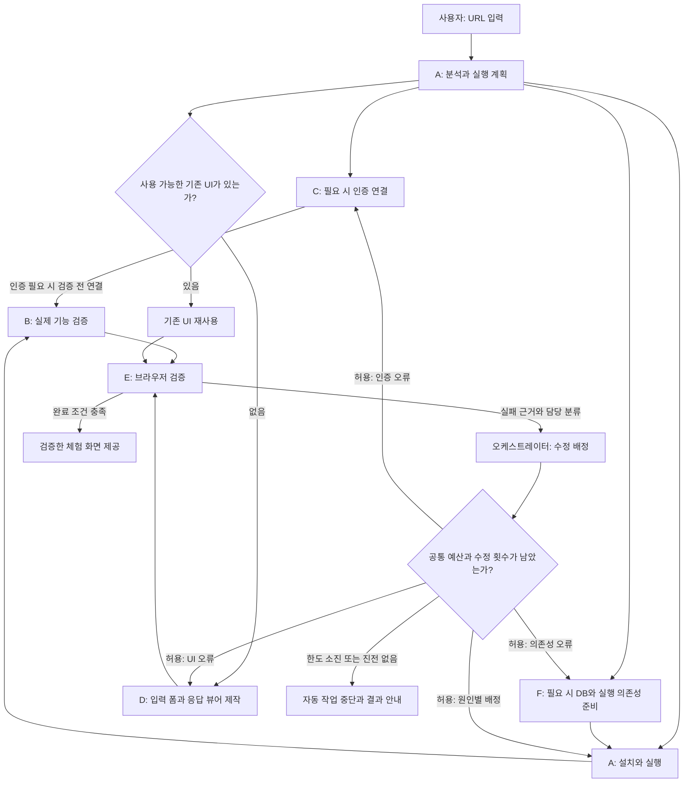

# URL to Playground — 제품 기획서

작성일: 2026-09-18  
최종 수정일: 2026-09-19  
상태: 로컬 MVP와 맥락 기반 실험·대안·리포트 확장을 구현했다. API는 Node.js 직접 호출로, 오픈소스는 Daytona로 실행한다. Open-Meteo와 python-qrcode의 실제 기능·브라우저 검증을 통과했다. DB·원본 UI 저장소의 원격 검증은 남아 있다. 구현 범위와 검증 결과는 [README.md](README.md)를 참고한다.
제품명: 가칭. 이 문서는 기본 체험의 기획 기준이다. 맥락 기반 실험·대안 추천·누적 기록·레시피·비교 리포트는 [EXPANSION_PLAN.md](EXPANSION_PLAN.md)를 확장 기준으로 적용한다.

2026-09-19 실행 경계 변경: 아래 샌드박스·설치·프리뷰 요건은 GitHub 오픈소스에 적용한다. API에는 생성 코드 실행 없이 신뢰된 HTTP 클라이언트와 앱 서버 Chromium 검증을 적용한다. 인증·호출 예산·만료·실험 기록은 두 경로에 공통 적용한다.

## 1. 제품 정의

**API 문서 또는 GitHub URL을 입력하면, 필요한 실행 환경을 준비하고 직접 조작할 수 있는 체험 화면을 제공한다.**

API는 샌드박스를 만들지 않고 앱 Node.js 서버에서 실제 요청을 보내고 응답을 읽기 쉬운 형태로 표시한다. 오픈소스는 Daytona에서 설치·실행하며, 기존 UI가 있으면 그대로 사용하고 없을 때만 최소한의 입력 화면과 결과 뷰어를 만든다. 에이전트가 기능과 브라우저 동작을 검증한 뒤 체험 화면을 제공한다.

API를 소재로 새로운 서비스를 기획하지 않는다. 응답 데이터의 의미와 구조에 맞게 표현을 개선하는 것이 UI 생성의 범위다.

제품 소개 문장:

> URL만 넣으면 설치와 연결을 준비하고, 실제로 눌러 볼 수 있는 체험 화면을 만들어 줍니다.

## 2. 해결할 문제와 사용자

사용자는 어떤 API나 오픈소스를 도입하기 전에 자신의 입력으로 어떤 결과가 나오는지 확인하고 싶다. 하지만 문서를 읽고, 실행 환경을 설치하고, 인증을 연결하고, 테스트 코드를 작성하는 과정이 먼저 필요하다. UI가 없는 도구는 결과를 이해하기 위한 작업도 추가된다.

주요 사용자는 다음과 같다.

| 사용자 | 하려는 일 | 제공할 가치 |
| --- | --- | --- |
| API 도입을 검토하는 개발자 | 문서의 예제가 실제로 동작하는지 확인 | 입력 폼과 실행 가능한 호출 코드, 읽기 쉬운 응답 |
| 오픈소스를 평가하는 개발자 | 로컬 설치 없이 기능 확인 | 작업별 임시 실행 환경과 체험 화면 |
| 기술 도구를 확인하는 기획자·디자이너 | 샘플 파일이나 값으로 결과 확인 | 터미널과 JSON 구조를 몰라도 사용할 수 있는 화면 |

핵심 사용자 작업은 `URL 입력 → 필요한 인증 연결 → 입력값 지정 → 실행 → 결과 확인`이다.

## 3. 확정 범위와 제외 범위

### 3.1 확정한 제품 원칙

- API와 GitHub 저장소를 입력으로 받는다. GitHub 저장소에도 외부 API 인증이 필요할 수 있으므로 실행 유형과 인증 요구를 별도로 판단한다.
- 기존 UI가 실제 대상 기능을 제공하면 재사용한다. HTML이나 문서 사이트가 있다는 이유만으로 UI가 있다고 판단하지 않는다.
- UI가 없으면 입력 폼, 실행 버튼, 결과 뷰어를 만든다.
- API 응답은 주요 값·표·그래프·미디어 등 적절한 형식으로 표현하고, 원본 JSON도 확인할 수 있게 한다.
- DB가 필요하면 임시 DB, 연결 정보, 마이그레이션, 체험 데이터까지 준비한다.
- API 키가 필요하면 공식 발급 경로와 입력 화면을 제공한다. 모든 제공사의 임시 키 자동 발급을 약속하지 않는다.
- 실제 실행과 브라우저 검증을 통과해야 완료로 표시한다.
- 에이전트 역할 수와 샌드박스 수를 동일하게 맞추지 않는다. 격리 단위는 사용자의 체험 작업이다.

### 3.2 MVP 지원 목표

| 구분 | 지원 목표 | 제한 |
| --- | --- | --- |
| API | HTTP REST, OpenAPI 명세 또는 읽을 수 있는 공식 문서 | 처음에는 대표 기능 1개를 선택해 완성 |
| API 인증 | 인증 없음, 사용자 입력 API 키·Bearer 토큰 | OAuth·자동 테스트 계정 발급은 제공사별 후속 지원 |
| 오픈소스 | 공개 GitHub 저장소, CPU 기반 Python·Node.js 프로젝트 | 설치·실행 절차를 확인할 수 있는 프로젝트부터 지원 |
| UI | 기존 웹 UI 또는 생성한 입력·결과 화면 | 데스크톱 전용 GUI는 제외 |
| DB | SQLite, PostgreSQL | 구체 버전과 설치 방식은 환경 검증 후 확정 |
| 검증 | 실제 기능 호출, 브라우저 입력·클릭·결과 확인 | 모든 기능을 검증했다고 주장하지 않음 |

대표 기능은 문서의 빠른 시작 예제와 프로젝트의 주 기능을 우선한다. 동등한 후보가 여러 개면 사용자에게 짧은 선택지를 제시한다. 준비 화면에 선택한 기능을 표시한다.

### 3.3 이번 범위에 포함하지 않는 것

- 응답을 바탕으로 별도의 서비스·추천 시스템·업무 흐름을 새로 기획하는 기능.
- 모든 저장소, 모든 언어, 모든 API의 무조건적인 실행 보장.
- 제3자 서비스의 무단 계정 생성, 인증 우회, 범용 임시 API 키 자동 발급.
- GPU 필수 모델, 대규모 모델 다운로드, 복잡한 다중 서비스 구성, 운영 데이터베이스 연결.
- 프로덕션 배포·상시 호스팅·결제 대행·장기 데이터 보관.
- 기존 지하철 서비스의 기능 확장과 코드 재사용. 새 제품은 이 기획을 기준으로 새로 구현한다.

## 4. 입력 유형별 처리

| 유형 | 준비할 것 | 최종 화면 |
| --- | --- | --- |
| API 문서·명세 URL | 호출 클라이언트, 필요한 인증, 요청·응답 명세 | 요청 입력 + 가독성 있는 응답 뷰어 |
| UI 없는 오픈소스 | 설치, 의존성, 실행 어댑터, 필요한 DB | 기능 입력 + 실행 결과 뷰어 |
| UI 있는 오픈소스 | 설치, 의존성, 필요한 DB와 체험 계정 | 원래 프로젝트의 UI |

GitHub 저장소가 SDK·라이브러리이면 대표 함수를 실행할 최소 어댑터를 만든다. CLI이면 문서화된 인자를 입력 폼에 연결한다. 서버 앱이면 원래 서버를 실행한다. 정적 라이브러리나 문서만 있고 체험할 실행 기능이 없는 경우에는 지원 불가 이유를 안내한다.

## 5. 사용자 화면과 흐름

### 5.1 URL 입력

첫 화면에는 URL 입력, 시작 버튼, 지원 범위 안내를 둔다. 사용자가 언어·DB·에이전트를 고르게 하지 않는다. 문서 URL인지 저장소 URL인지부터 시스템이 분석한다.

### 5.2 준비 상태

사용자에게는 `분석 중 / 인증 필요 / 환경 준비 중 / 기능 확인 중 / 화면 확인 중 / 준비 완료`처럼 이해하기 쉬운 상태를 보여준다. 현재 체험할 기능과 필요한 사용자 입력을 함께 표시한다. 에이전트 로그와 설치 상세는 접힌 상세 보기로 제공한다.

#### A의 문서 탐색과 근거 확인

입력 URL은 문서 탐색의 시작점이다. 본문뿐 아니라 목차, 빠른 시작, 인증 안내, 요청·응답 명세, 링크된 OpenAPI를 따라간다. 필요한 경우 별도 Chromium 세션에서 동적 본문·문서 탭·iframe을 읽고, 텍스트 근거가 부족하면 문서 이미지를 보조적으로 판독한다. 추측한 호출 주소나 읽지 못한 이미지 내용을 실행 근거로 쓰지 않는다.

여러 상품이 섞인 가이드는 확인된 상품 링크를 사용자에게 보여주고 선택한 대상의 분석을 이어간다. 선택 자체에는 모델을 호출하지 않는다. 첫 페이지에 엔드포인트가 없다는 이유로 즉시 지원 불가 처리하지 않으며, 제한 안에서 탐색한 뒤에도 근거가 부족하면 부족한 항목과 확인한 출처를 표시한다.

수집 1회 상한은 본문 8개·깊이 3·요청 40회·12MB·120초이며 브라우저 2페이지와 이미지 2개(각 1MB)까지다. 선택을 포함한 작업 전체에 본문 24개·요청 160회·선택 대기 3회와 기존 모델·비용 상한을 함께 적용한다. 공개 자료만 읽고 비밀정보를 문서 브라우저에 전달하지 않는다. PDF·인증 뒤 문서·비표준 탐색의 현재 제한은 README에 명시한다.

#### A의 분석 결과에 따른 단계형 프로그레스 바

URL 접수 직후에는 `URL과 실행 방법을 분석하고 있어요`라는 진행 표시를 제공한다. 아직 전체 작업을 모르는 분석 단계에는 임의의 퍼센트를 붙이지 않는다.

A의 분석이 끝나면 오케스트레이터가 실행 계획을 검증하고, 실제 필요한 단계 목록을 확정해 프로그레스 바를 표시한다. 이 바는 제어 웹에 미리 구현한 공통 UI다. A나 D가 작업마다 진행 화면 코드를 생성하지 않는다.

- 기본 단계: `분석 완료 → 환경 준비 → 실행 → 기능 확인 → 화면 확인 → 체험 준비 완료`.
- 인증이 필요하면 `인증 연결`, DB가 필요하면 `DB 준비`, 기존 UI가 없으면 `화면 구성` 단계를 추가한다. 필요 없는 단계는 처음부터 포함하지 않는다.
- 위 순서는 읽기 위한 표시 순서다. 실제 의존 관계에 따라 병렬 작업할 수 있고, 진행 중 단계가 여러 개면 모두 표시한다.
- 각 단계는 `대기 / 진행 중 / 사용자 입력 필요 / 수정 중 / 완료 / 실패 / 취소` 상태를 텍스트와 아이콘으로 구분한다. 색상만으로 상태를 전달하지 않는다.
- 바의 채움은 `완료 단계 수 / 전체 필수 단계 수`로 계산하고 `7단계 중 3단계 완료`처럼 표시한다. 이는 남은 시간이나 작업량의 비율이 아니다. 단순 시간 경과로 채우거나 근거 없는 예상 완료 시간을 표시하지 않는다.
- 현재 작업은 `필요한 패키지를 설치하고 있어요`, `브라우저에서 실행 버튼을 확인하고 있어요`처럼 짧게 설명한다. A–F 이름과 원본 로그는 상세 보기로 보낸다.
- 인증 대기에는 해당 단계에 `API 키 입력이 필요해요`와 입력 카드를 연결한다. 다른 단계가 진행 중이면 함께 보여주고, 모든 작업이 대기 중일 때만 전체 상태를 사용자 입력 대기로 표시한다.
- 재시도는 기존 단계에 `수정 중 · 전체 수정 1/6회`로 표시한다. 새 단계나 별도 작업으로 추가해 진척률·예산을 부풀리지 않는다. 수정으로 이전 검증이 무효화되면 해당 단계를 다시 진행 상태로 바꾸고 재검증 이유를 표시한다.
- 뒤늦게 의존성을 발견해 계획을 바꾸면 계획 버전을 갱신하고 `DB 준비 단계가 추가됐어요`처럼 변경 이유를 표시한다. 완료 수가 줄거나 전체 단계 수가 늘 때도 실제 상태를 그대로 반영한다.
- 마지막 `체험 준비 완료` 단계는 최종 주소에서 검증을 통과하고 `READY`가 된 경우에만 완료한다. 실패·한도 소진·취소 시에는 바를 멈추고 원인과 마지막 성공 단계를 보여준다.
- 진행 상태는 서버 이벤트와 검증 결과로 갱신한다. 상태 문구와 바 갱신을 위해 모델을 추가 호출하지 않는다. 연결이 끊기면 마지막 갱신 시각과 재연결 상태를 표시하고 진행 애니메이션으로 정상 실행을 가장하지 않는다.
- 새로고침·재접속 시 기존 작업의 진행 상태를 복원한다. 화면 재접속이 새 에이전트 실행이나 예산 초기화를 유발하지 않는다.

화면에는 단계형 바, 완료 단계 수, 현재 작업 설명, 필요한 사용자 입력, 취소 버튼을 함께 둔다. 체험 준비가 끝나면 같은 페이지에 실제 체험 화면을 표시하고 진행 내역은 접어 볼 수 있게 한다.

### 5.3 인증 입력

문서 분석 직후, 실제 API 호출 전에 사이트 안의 **내 API 키로 연결하기** 카드로 안내한다. 운영자에게 외부 API 요금 등록을 요청하며 종료하지 않는다.

- 서비스와 호출 대상, 공식 발급 페이지를 한 번에 여는 버튼, C가 문서에서 확인한 2~4단계 발급 설명을 표시한다. 직접 발급 링크가 확인되지 않으면 공식 발급 가이드를 제공하며 메뉴·주소를 추측하지 않는다.
- 이미 키가 있으면 발급 안내를 접고 키 입력으로 바로 이동한다. 마스킹된 입력, 보기/숨기기, 연결 버튼을 제공한다. 외부 로그인·가입·키 생성은 사용자가 공식 새 탭에서 수행하며 이 사이트는 키 입력 위치와 절차를 안내한다.
- 사용자 확인 후에만 환경 준비와 검증을 시작한다. 키를 암호화 저장하고 모델·로그·일반 작업 JSON에 포함하지 않는다. 종료 시 삭제한다.
- 이번 체험의 합산 호출 한도는 기본 20회, 3~50회에서 선택한다. 기능·브라우저 검증, 실패 호출, 수정 재시도, 사용자 실행에 공통 적용하며 키 교체로 초기화하지 않는다.
- 요금 미확인 API는 과금 가능성과 금액 상한 미보장을 표시하고 사용자 확인 후 횟수 제한으로 진행한다. 비용은 미확인으로 보존한다. 무료 잔여 한도 확인 또는 호출 단가·총예산 입력은 같은 화면의 선택 항목이다. 무료 잔여량을 제공사 계정에서 자동 조회한다고 표현하지 않는다.
- 401/403은 원인을 알리고 같은 발급 안내에서 키를 다시 입력받는다. 이때 모델 수정 요청을 만들거나 호출 한도를 초기화하지 않는다. 대상 URL·인증 방식이 바뀌면 새 확인을 받는다.
- HTTP·HTTPS와 공개 API의 명시적 포트를 지원한다. URL 경로 인증은 인증키를 일반 입력과 분리하고 실행 시 한 경로 구간에 인코딩해 삽입한다. HTTP 키 전송은 대상 주소와 평문 노출을 연결 카드에 알리고 별도 사용자 확인을 받는다. 확인은 정확한 프로토콜·호스트·포트·API 경로·인증 방식에 묶으며 목적지가 바뀌면 다시 받는다. 공개망 검사·리다이렉트 차단·사용량 제한은 유지한다.
- 단계 이동과 상태 갱신 동안 입력은 현재 폼에서 유지하며 브라우저 저장소에 키를 저장하지 않는다. 서버 연결을 기다리는 동안 바는 정지한다.

### 5.4 체험

생성 화면의 기본 구조는 왼쪽 요청 입력, 오른쪽 결과다. 모바일에서는 입력과 결과를 위아래로 배치한다. 필수 입력은 먼저 보여주고, 선택 옵션은 접을 수 있게 한다. 실행 중·성공·빈 결과·실패 상태를 구분한다.

기존 UI가 있는 프로젝트는 메인 페이지의 체험 영역에 표시한다. 임베드가 불가능한 프로젝트는 이유와 함께 별도 체험 탭을 제공한다. 프리뷰 방식·쿠키·정적 파일 경로·WebSocket 호환성은 구현 시 검증한다.

### 5.5 종료와 만료

체험의 만료 시각과 종료 버튼을 제공한다. 임시 파일과 DB 데이터는 작업 종료 시 폐기한다. 필요한 결과 파일은 만료 전에 다운로드할 수 있다. 만료된 체험은 그대로 동작하는 것처럼 표시하지 않고 재생성 동선을 제공한다.

## 6. 응답 뷰어 설계

### 6.1 표현 원칙

**원본 정보는 유지하고, 읽는 순서와 표현을 바꾼다.**

문서와 실제 응답에서 필드 의미·단위·구조를 확인한 뒤 표현을 선택한다. 필드명만으로 단위나 의미를 추측하지 않는다. 새 점수, 추천, 예측, 사실을 만들어 넣지 않는다. 주요 값은 먼저 보여주고 나머지는 상세 보기에서 접근할 수 있게 한다.

뷰어는 엔드포인트 또는 기능별로 구성하고, 요청마다 UI를 새로 생성하지 않는다. 이후 실행에서는 데이터만 갱신한다. 응답 구조가 달라져 기존 뷰어로 표현하지 못하면 오류를 숨기지 않고 원본 보기와 재분석 상태를 제공한다.

### 6.2 데이터 유형과 표현

| 데이터 형태 | 기본 표현 | 선택 조건 |
| --- | --- | --- |
| 단일 객체 | 제목, 주요 값, 상세 속성 | 중요도를 문서·기능 맥락으로 확인 |
| 같은 구조의 객체 배열 | 검색·정렬 가능한 테이블 | 표시 중인 데이터 범위 명시 |
| 시간에 따른 수치 | 선 그래프와 원본 표 | 시간 필드와 수치 단위가 명확할 때 |
| 좌표 데이터 | 위치 정보, 지도 | 좌표계·위경도 의미가 확인될 때. 지도는 후속 확장 가능 |
| 이미지·오디오·영상 | 미리보기·재생 | 실제 반환한 지원 미디어일 때 |
| 긴 텍스트 | 문단, 줄바꿈, 펼치기 | 내용을 임의 요약·변경하지 않음 |
| 중첩 객체·배열 | 그룹별 접기·펼치기 | 하위 값에 접근 가능해야 함 |
| 파일 결과 | 파일명·형식·크기와 다운로드 | 실제 생성된 파일만 제공 |
| 오류 | 코드·메시지·관련 입력 구분 | 기술 상세는 접어서 제공 |

MVP 필수 뷰어는 주요 값, 테이블, 중첩 보기, 텍스트, 이미지, 파일 다운로드다. 시간 그래프·지도·추가 미디어는 지원 검증 후 확장한다.

### 6.3 예시

아래 예시는 실제 API 연결 결과가 아닌 표현 규칙 설명용 데이터다.

```json
{
  "city": "Seoul",
  "temperature": 23,
  "temperature_unit": "C",
  "humidity": 65,
  "condition": "cloudy"
}
```

문서에서 습도 단위가 퍼센트이고 상태 값이 흐림을 뜻한다고 확인했다면 `Seoul · 흐림`, `23°C`, `습도 65%`로 표시한다. 우산 추천이나 외출 일정은 추가하지 않는다. 문서에서 단위를 확인하지 못하면 임의로 `%`를 붙이지 않는다.

### 6.4 원본과 표시 결과의 일치

- `보기 / 원본 JSON` 전환을 제공한다. JSON이 아닌 응답은 해당 형식의 원본·다운로드 경로를 제공한다.
- `0`, `false`, 빈 문자열, `null`, 필드 누락을 서로 구분한다.
- 표시 값은 원본 필드 경로와 연결한다. 포맷팅·단위 변환이 있으면 변환 규칙을 기록한다.
- 페이지네이션 응답을 전체 데이터로 표현하지 않는다. 정렬·검색이 현재 받은 데이터에만 적용되면 표시한다.
- 큰 응답은 표시 한도를 두고 생략 여부를 알린다.
- 비밀정보는 원본 보기와 로그에서도 마스킹한다.

### 6.5 공통 UI 재사용과 생성 범위

페이지 품질과 생성 비용을 함께 관리하기 위해 공통 UI를 먼저 구현한다. D가 매번 전체 페이지·스타일·컴포넌트를 새로 작성하지 않는다.

- 공통 제공: 요청·결과 레이아웃, 입력란·버튼, 로딩·빈 결과·오류 상태, 주요 값 카드, 테이블, 중첩 데이터 보기, 미디어·파일 결과, 원본 보기.
- 디자인 고정: 글꼴, 색상, 여백, 컴포넌트 상태, 모바일 대응 규칙을 템플릿에 포함한다.
- 작업별 생성: 필요한 입력 필드, 원본 필드와 표시 값의 연결, 표시 우선순위, 뷰어 선택, API·실행 어댑터 연결 코드.
- 예외적인 출력 형식에만 추가 컴포넌트를 작성한다. 기존 UI가 있는 저장소는 이 생성 단계를 생략한다.
- 체험 화면에서 실행 버튼을 다시 누르는 것은 일반 코드 실행이다. 매 요청마다 모델을 호출하거나 UI를 재생성하지 않는다.
- 응답 구조 변경은 먼저 원본 보기로 처리하고 재분석 필요 상태를 표시한다. 자동 재분석·재생성 반복을 시작하지 않는다.

## 7. 에이전트 역할

역할은 논리적 책임이다. 각 역할을 별도 상시 서버나 샌드박스로 만들 필요는 없다. 중앙 오케스트레이터가 작업 상태, 실행 권한, 순서, 재시도 예산을 관리한다.

| 역할 | 책임 | 완료 결과물 |
| --- | --- | --- |
| A — 분석·실행 | URL 분석, 대표 기능·실행 계획 수립, 설치, API 클라이언트·실행 어댑터 구현, 기존 앱 실행 | 실행 계획, 입출력 계약, 실행 주소, 의존성·인증 요구 |
| B — 기능 검증 | UI 없이 실제 요청·파일로 기능 검증, DB 연결 검증, 실패 재현 | 테스트 입력, 기대 조건, 실제 결과, 실패 근거 |
| C — 인증 연결 | 공식 인증 문서·발급 페이지 확인, 필요한 입력 항목 제시, 연결 확인 절차 정의 | 인증 요구 명세, 공식 링크, 연결 상태 |
| D — UI 구성 | 기존 UI의 재사용 가능 여부 확인, UI가 없으면 입력 폼·응답 뷰어 구현 | 뷰어 명세, 프런트엔드, 실행 기능과의 연결 |
| E — 브라우저 검증 | 실제 입력·클릭·결과·다운로드 확인, 오류 담당 분류, 수정 후 재검증 | 통과 시나리오, 브라우저 증거, 검증한 버전·주소 |
| F — 실행 인프라 | 필요한 DB·캐시·서비스 구성, 마이그레이션·시드·체험 계정 준비 | 의존 서비스 상태, 연결 참조, 초기화 결과 |

C는 키를 대화로 받는 역할이 아니다. 사용자 입력은 비밀정보 저장 경로로 직접 전달하고, 에이전트에는 키 값 대신 참조 이름과 연결 상태를 제공한다.

기존 UI가 있어도 오류 수정이 필요하면 D가 연결·표시 문제를 처리할 수 있다. 원래 앱의 비즈니스 기능을 임의로 다시 설계하지 않는다.

### 7.1 모델 배정과 상위 모델 사용

초기 기본값은 **Terra medium + 공통 UI 컴포넌트 + 해결되지 않은 오류에만 Sol medium**이다. 아래 배정은 실제 대상 프로젝트에서 성공률·완료 시간·총비용을 측정해 조정할 초기 정책이며, 품질을 검증 완료했다는 의미는 아니다.

| 대상 작업 | 모델 ID | 추론 수준 | 사용 원칙 |
| --- | --- | --- | --- |
| A의 코드 작성·설치·실행, B의 테스트 설계, D의 UI 구현, E의 브라우저 검증, F의 DB 구성 | `gpt-5.6-terra` | `medium` | 기본 모델 |
| URL·문서 분류, C의 인증 안내, 범위가 명확한 필드 추출 | `gpt-5.6-luna` | `low` | 짧은 입력과 구조화된 출력 사용 |
| Terra로 해결되지 않은 설치·코드·검증 오류 | `gpt-5.6-sol` | `medium` | 실패 근거와 관련 코드만 전달하는 제한적 상향 |

- Sol 사용은 모델이 직접 결정하지 않는다. 오케스트레이터가 실패 근거, 남은 수정 횟수, 시간, 토큰·비용 예산을 확인해 허용한다.
- Sol은 별도의 무제한 해결사가 아니다. 작업당 최대 1개 수정 라운드에서 모델 요청 최대 2회만 허용하며 모든 호출은 공통 예산에 포함한다.
- 상위 모델로 전환해도 기존 실패·수정 횟수와 누적 사용량을 유지한다. 허용 목록 밖 모델이나 더 높은 추론 수준으로 임의 전환하지 않는다.
- 프로세스 생존, HTTP 상태, 스키마·DB 연결 검사는 코드로 수행한다. 모델은 테스트 설계와 예외 분석에 사용한다.
- D에는 계약과 UI 템플릿, E에는 체험 주소와 검증 조건, 오류 수정 담당에는 관련 파일과 실패 로그만 전달한다. 전체 저장소·대화·설치 로그를 모든 역할에 반복 전달하지 않는다.
- 긴 출력은 실행 환경에 저장하고 필요한 부분만 읽는다. 요약·추가 문서 검색·컨텍스트 압축에도 모델을 사용하면 같은 호출·토큰·비용 한도를 적용한다.

모델 선택 근거 문서: [Terra](https://developers.openai.com/api/docs/models/gpt-5.6-terra), [Luna](https://developers.openai.com/api/docs/models/gpt-5.6-luna), [Sol](https://developers.openai.com/api/docs/models/gpt-5.6-sol). 요율은 [공식 가격표](https://developers.openai.com/api/docs/pricing)를 구현·배포 시 다시 확인한다. 모델 선택과 CLI/API 인증 방식은 별개이며, 아래 비용 통제는 과금 사용량을 계측할 수 있는 API 인증을 기준으로 설계한다.

## 8. 실행 순서와 상태 관리



- A가 최소 입출력 계약을 확정하면 D와 환경 준비를 병행할 수 있다.
- C·F는 필요한 작업에서만 실행한다. 해당 요구가 없으면 즉시 준비 상태로 처리한다.
- 인증이 없을 때도 설치와 화면 준비는 진행할 수 있다. 실제 인증 호출은 대기한다.
- B 통과, UI 준비, 필수 인증·의존성 준비를 모두 만족해야 E의 최종 검증을 시작한다.
- 수정 요청에는 실패 입력, 기대 결과, 실제 결과, 로그, 대상 버전을 포함한다. 막연한 재생성 요청을 보내지 않는다.
- 서버·어댑터 오류는 A, UI 오류는 D, 인증은 C, DB·서비스 오류는 F가 담당한다. 원인이 불분명하면 B가 재현한다.
- A·D·F의 병행 작업은 담당 파일·설정 범위를 나누고 계약 변경은 오케스트레이터를 통해 공유한다.
- A의 분석 계획에서 사용자용 진행 단계를 만든다. 단계 완료는 에이전트의 자연어 선언만으로 인정하지 않고 설치 종료·프로세스 상태·기능 테스트·브라우저 검증 등 단계별 증거로 확정한다.

최상위 상태는 `ANALYZING → PREPARING → VERIFYING → READY`다. 인증 대기는 별도 `WAITING_FOR_USER` 표시와 하위 작업 상태로 관리한다. 종료 상태는 `FAILED / UNSUPPORTED / CANCELLED / EXPIRED`로 구분한다.

한도 소진은 `FAILED`의 사유 `BUDGET_EXCEEDED`, 준비 시간 초과는 `TIME_LIMIT_EXCEEDED`, 진전 없는 반복은 `NO_PROGRESS`로 기록한다. 중단된 작업은 자동으로 새 작업을 생성하거나 다시 큐에 넣지 않는다.

실패 원인이 키 입력·지원 환경·프로젝트 버그 중 무엇인지 설명한다. 실패 결과를 모의 데이터로 바꾸어 성공처럼 표시하지 않는다.

## 9. 구현 구조와 Daytona 사용

### 9.1 제어 서버와 실행 환경

제어 서버는 URL 접수, 작업 상태, 에이전트 호출, Daytona 수명주기, 인증 참조, 결과 전달을 담당한다. 외부 저장소 코드·생성 코드·설치 스크립트는 작업용 Daytona 환경에서 실행한다.

기본 단위는 `체험 작업 1개 = 실행 샌드박스 1개`다. 앱·생성 UI·지원 DB를 해당 작업 환경 안에 구성하는 방식을 우선 검증한다. 추가 서비스가 별도 환경을 요구하면 MVP 지원 범위 여부를 판단한다. Docker Compose나 중첩 컨테이너 사용 가능 여부를 확인 없이 전제하지 않는다.

E의 브라우저는 체험 주소에 실제 접속한다. 브라우저 실행 환경의 배치는 기술 검증으로 확정한다. 에이전트 6개를 이유로 샌드박스 6개를 만드는 구조는 사용하지 않는다.

### 9.2 실행 도구

에이전트는 파일 읽기·쓰기, 패키지 설치, 프로세스 실행, 로그 확인, HTTP 요청, 브라우저 검증 도구를 사용한다. 구현 속도를 위해 코딩 역할에는 Codex CLI 활용을 우선 검토한다. 단, 9.4~9.6의 호출 전 예산 통제와 자격증명 분리를 충족하는 연결 방식이어야 한다. 이를 충족하지 못하면 API 호출·도구 실행 루프를 직접 구현한다. 브라우저는 별도 실행 도구를 연결하며 CLI 설치만으로 자동 제공된다고 가정하지 않는다.

### 9.3 Daytona가 필요한 이유

체험할 저장소의 설치 스크립트, 원래 앱, AI가 만든 어댑터·UI가 실제로 실행된다. 프로젝트마다 의존성·파일·DB 상태가 다르며 실패와 재시도가 발생한다. 이를 본 서비스와 다른 사용자의 작업으로부터 분리하고 작업 종료 시 정리하는 것이 Daytona의 역할이다.

### 9.4 실행 경계

- 생성 앱과 외부 코드는 제어 서버의 파일 시스템·관리 자격증명에 접근하지 못하게 한다.
- 제어 서버의 OpenAI·Daytona 키를 체험 환경에 전달하지 않는다.
- API 체험용 외부 키는 가능하면 제어 서버의 제한된 호출 중계를 통해 사용한다. 임의 목적지·임의 자격증명을 선택하는 범용 중계는 만들지 않는다.
- 기존 앱이 직접 외부 키를 필요로 하면 해당 작업에 필요한 키만 주입한다. 코드는 실행 중 그 키에 접근할 수 있으므로 샌드박스가 키 유출까지 자동 방지한다고 가정하지 않는다. 지원 범위와 네트워크 제한을 별도로 검증한다.
- URL 수집·API 호출에서 내부망과 클라우드 메타데이터 주소로의 접근을 제한하고 리다이렉트도 검사한다.
- MVP의 Daytona 환경은 계정 기본 네트워크 정책을 사용한다. API·저장소 생성, 설치 후 실행, 수정 재시도에서 작업별 네트워크 허용 목록이나 전체 외부 통신 차단을 추가하지 않는다. Tier 1·2의 조직 제한은 제공자 정책이며 앱이 해제하지 못한다. Tier 3·4로 업그레이드한 뒤 새 체험은 기본 외부 인터넷 접속을 사용한다.
- 체험 UI는 제어 페이지와 출처를 분리하고, 프리뷰 접근 권한을 작업 소유 범위에 맞춘다.
- 파일 크기, 응답 크기, 실행 시간, 동시 작업 수에 한도를 둔다.
- 모든 모델 요청과 실행 도구는 제어 서버의 예산 검사 경로를 통과한다. 모델 프롬프트의 "최대 N회" 지시만으로 제한을 구현하지 않는다.
- 에이전트가 임의 하위 에이전트·반복 CLI·백그라운드 모델 호출을 만들어 계측을 우회하지 못하게 한다. 생성 앱과 저장소 코드에는 모델·Daytona 관리 자격증명을 주지 않는다.
- CLI를 사용하더라도 내부 모델 요청, 재시도, 하위 작업을 포함해 아래 한도를 집행할 수 있어야 한다. CLI 프로세스 시작 한 번을 모델 요청 한 번으로 계산하지 않는다. 호출 전 통제가 불가능한 연결 방식은 MVP에서 사용하지 않는다.

### 9.5 작업 전체의 강제 상한

다음 값은 구현·시연을 위한 초기 설정이다. 운영자가 측정 결과에 따라 변경할 수 있지만 **작업을 시작하면 해당 작업의 상한은 고정**한다. 모델·에이전트는 변경할 수 없다. 하나의 상한이라도 먼저 도달하면 추가 자동 작업을 중단한다. 제어 서버의 SQLite 원장과 예약 경로를 구현했으며, 실제 제공사·샌드박스를 포함한 통합 집행 검증은 별도로 수행한다.

| 항목 | 초기 상한 |
| --- | --- |
| 자동 준비·검증 시간 | 합산 30분. 모든 실행 작업이 멈춘 순수 사용자 입력 대기만 제외 |
| 전체 자동 수정 | 최초 구현 이후 최대 6개 수정 라운드. A–F 전체 합산 |
| 모델 요청 | 작업 전체 최대 48회, 역할별 최대 16회. 실제 제공사 요청 시도 기준 |
| 동시 모델 요청 | 작업당 최대 2개. 둘 다 사전에 공통 예산 예약 |
| Sol 사용 | 최대 1개 수정 라운드, 해당 작업에서 Sol 요청 최대 2회 |
| 모델 입력 토큰 | 요청당 최대 20,000, 작업 전체 누적 300,000 |
| 모델 출력 토큰 | 요청당 최대 4,000, 작업 전체 누적 80,000. 과금 대상 추론 토큰 포함 |
| 모델·유료 모델 도구 비용 | 작업 전체 합산 최대 US$3 |
| 일일 모델·유료 모델 도구 비용 | 사용자별 US$20, 서비스 전체 US$50. 서버의 고정 일자 기준, 동시 작업 합산 |
| 일시적 통신 오류 재전송 | 같은 논리 요청당 최대 1회 추가. 실제 전송은 48회 제한에 각각 포함 |
| 모델 응답 대기 | 요청당 최대 90초 또는 남은 작업 시간 중 짧은 값 |
| 도구 실행 횟수 | 작업 전체 최대 400회. 셸·파일·HTTP·브라우저 작업 합산 |
| 브라우저 검증 | 최초 검증과 수정 후 검증을 합해 최대 7회, 전체 브라우저 동작 최대 600회 |
| 단일 준비 명령 실행 | 최대 120초 또는 남은 작업 시간 중 짧은 값. 앱·DB 서버 프로세스는 별도 수명 관리 |
| 자동 검증의 외부 API 요청 | 자동 검증 최대 40회. 사용자 확인 API는 별도의 합산 호출 한도(기본 20회, 최대 50회)를 함께 적용; 요금 미확인 시 과금 가능성 확인 전 호출 금지 |
| 사용자별 동시 준비 작업 | 최대 1개. 중복 제출·페이지 새로고침으로 추가 생성하지 않음 |
| 완료 후 체험 유지 | 60분 |
| 사용자 입력 대기 만료 | 30분 |
| Daytona 환경 예약 시간 | 작업당 120분. 준비 30분·입력 대기 30분·체험 60분을 수용 |
| Daytona·체험용 외부 API 비용 | 별도 예산과 실행 자원·호출 한도를 시작 전에 확정. 모델 비용 상한에 포함된 것으로 오인하지 않음 |

입력 토큰 누적에는 다시 전송한 대화·도구 결과와 캐시 입력도 포함한다. 출력 길이를 채팅에 보이는 문자 수로 계산하지 않는다. SDK·CLI의 기본 자동 재시도와 내부 호출도 위 한도에 포함하거나 비활성화한다. 지원 모델의 출력 제한이 추론 토큰까지 제어하는지 어댑터 구현 시 검증한다.

### 9.6 예산 집행과 무한 반복 방지

1. **작업 공통 원장:** `jobId`별 호출 수, 입력·출력 토큰, 비용, 실행 시간, 수정 라운드, 도구 동작, 예약 예산을 영속 저장한다. 역할 교체·프로세스 재시작·CLI 재실행·모델 전환으로 초기화하지 않는다.
2. **호출 전 예약:** 입력 토큰과 출력 상한으로 예상 최대 비용을 계산한다. 사용량과 진행 중 예약분을 합해 작업·사용자·서비스 상한을 확인하고 원자적으로 예약한 뒤 호출한다. 캐시 할인을 미리 가정하지 않으며, 캐시 쓰기·도구 요금도 적용 조건에 맞게 반영한다. 단가나 토큰을 신뢰성 있게 산정할 수 없으면 자동 호출하지 않는다.
3. **호출 후 정산:** 제공사 사용량으로 예약을 정산한다. 응답 유실·타임아웃으로 사용량을 모르면 0원으로 처리하지 않고 예약분을 유지한다. 중복 응답은 같은 요청 ID로 한 번만 정산한다. 타임아웃이 과금 취소를 뜻하지는 않는다.
4. **제한된 수정:** 수정 라운드는 실패 묶음에 대한 수정과 재검증 한 세트다. 담당자를 바꿔도 새 예산을 주지 않는다. 같은 라운드에서 각 담당자의 수정은 한 차례만 수행하고, 재검증에서 다시 실패하면 다음 라운드로 계산한다.
5. **진전 없는 반복 차단:** 같은 실패 지문이 관련 코드·설정·입력 변화 없이 다시 발생하면 동일 명령·요청을 반복하지 않는다. 자격증명 누락, 권한 거부, 지원하지 않는 런타임은 사용자 입력 대기나 지원 불가로 분류한다. 해결 불가능한 조건을 모델 변경으로 계속 시도하지 않는다.
   - 분석 근거 부족은 즉시 실패시키지 않고 최대 2회 복구한다. 첫 회는 누락된 메서드·URL·입력·인증 근거를 이전 오류와 함께 재검토하고, 두 번째는 확인된 관련 문서·동적 본문을 제한적으로 보완한다. 분석 복구도 전체 자동 수정 횟수와 모델·문서·시간·비용 예산을 공유한다. 새 근거가 없거나 실제 지원 불가·예산 소진·취소인 경우 반복하지 않는다.
6. **통신 재시도 분리:** 일시적 오류만 지연 후 1회 재전송한다. 인증·입력 오류는 그대로 반복하지 않는다. 부작용이 있는 API 요청은 멱등성이 확인되지 않으면 자동 재전송하지 않는다. 재시도도 공통 시간·호출·비용 한도를 차감한다.
7. **도구 내부 반복 제한:** 한 번의 셸·브라우저 스크립트 안에서 반복 실행한다고 한도를 우회할 수 없어야 한다. 실행 시간·프로세스·네트워크 요청과 브라우저 동작을 실행기에서 제한한다. 측정 불가능한 임의 실행에는 더 좁은 시간·네트워크 경계를 적용한다.
8. **중단 집행:** 한도 도달·취소 시 신규 예약과 작업 배정을 막고 대기 큐를 취소한다. 진행 중 모델 요청은 가능한 범위에서 취소하고, 자동 실행 프로세스와 브라우저를 종료한다. 이미 발생한 사용료·지연 도착한 정산은 계속 원장에 반영한다. 실패 안내와 자원 정리는 추가 모델 호출 없이 코드로 수행한다.
9. **중단 결과:** 마지막 성공 단계, 실패 이유, 소진한 한도, 사용량을 표시한다. 미완성 화면은 준비 완료로 공개하지 않는다. 다시 실행하려면 사용자의 명시적인 새 요청이 필요하고, 새 요청도 일일 한도를 공유한다. 운영자만 한도 정책을 변경할 수 있다.

예산 검사는 정상 화면 생성만큼 필수적인 완료 조건이다. 병렬 호출이 각각 남은 예산을 중복 사용하거나, 검증 에이전트와 구현 에이전트가 서로 무한히 작업을 보내는 구조를 허용하지 않는다.

### 9.7 체험 중 비용과 자원 정리

`READY` 이후에는 에이전트 반복을 종료한다. 사용자의 일반적인 버튼 클릭에는 모델을 호출하지 않고 준비된 코드로 처리한다. 체험 중 외부 API 사용은 자동 검증과 합산한 사용자 확인 호출 한도·선택적 비용 한도와 만료 시간을 적용한다. 제공사의 요금·중지 지연 때문에 완전한 실시간 금액 차단이 어려우면 보수적인 자원·시간·요청 상한을 함께 적용하고 그 한계를 기록한다.

취소·실패·만료 시 작업 프로세스, 임시 DB·파일, 프리뷰 접근을 정리한다. 환경 삭제와 외부 API 키 폐기는 별개다. 사용자가 제공한 장기 키를 임의 폐기하지 않고 우리 서비스의 저장·연결을 해제한다. 제공사별 임시 키를 발급한 경우에는 지원되는 폐기 절차를 따로 수행한다.

## 10. 에이전트 간 계약

자유로운 자연어 보고만으로 다음 단계를 실행하지 않는다. 아래 정보를 구조화해 공유하고, 인증 값 자체는 포함하지 않는다.

| 결과물 | 필수 내용 |
| --- | --- |
| 분석 결과 | 원본 URL, 유형, 저장소 커밋 또는 문서 출처, 대표 기능, 지원 여부·사유 |
| 실행 계획 | 런타임, 설치·시작 절차, UI 유무, 필요한 DB·외부 서비스·인증 |
| 기능 계약 | 입력 필드·파일, 필수 여부, 요청 방식, 응답 형태, 오류, 상태 변경 여부 |
| 뷰어 명세 | 원본 필드 경로, 표시 라벨·단위의 근거, 컴포넌트, 빈 값·오류 처리 |
| 인증 요구 | 공식 링크, 인증 방식, 필요한 권한, 비밀정보 참조 이름, 연결 상태 |
| 실행 결과 | 서비스 상태, 포트·주소, 파일 결과 위치, 코드 버전, 마스킹된 로그 |
| 검증 결과 | 대상 버전, 테스트 입력, 기대 조건, 실제 결과, 증거, 실패 담당 |
| 예산·중단 상태 | 작업 ID, 정책 버전, 누적·예약 사용량, 남은 한도, 수정 라운드, 중단 사유 |
| 진행 상태 | 작업 ID, 계획 버전, 단계 ID·의존 관계·상태, 완료 증거 참조, 현재 작업, 수정 라운드, 사용자 입력 필요 여부, 갱신 시각, 이벤트 순번 |

특히 UI가 기대하는 응답과 A가 제공하는 응답을 같은 계약으로 관리한다. 계약이 변경되면 관련 B·D·E 검증을 다시 수행한다.

진행 이벤트는 작업 ID·계획 버전·이벤트 순번으로 중복과 순서 역전을 처리한다. 프런트엔드는 서버의 최신 상태를 기준으로 복원하며, 오래된 완료 이벤트가 실패·취소·재검증 상태를 덮어쓰지 못하게 한다.

## 11. 완료 기준

아래 조건을 만족한 대상 기능만 `READY`로 표시한다.

1. 실제 실행 환경에서 프로세스 또는 호출 클라이언트가 정상 작동한다.
2. 필요한 인증·DB·마이그레이션이 준비되고 앱에서 사용할 수 있다.
3. 대표 입력으로 실제 호출·실행이 성공하고, B가 기능 계약에 맞는 결과를 확인했다.
4. E가 사용자와 같은 화면에서 입력·버튼·결과를 확인했다. 파일 기능은 업로드·다운로드도 확인한다.
5. 표시 값과 원본 결과가 일치한다. 빈 값·오류가 성공 결과로 오인되지 않는다.
6. 제공할 주소와 코드가 검증한 버전과 같다. Chromium은 같은 샌드박스의 내부 서비스에서 핵심 동작을 검증하고, 제어 서버는 최종 공개 프리뷰의 HTTP 응답을 별도로 확인한다. 공통 화면은 버전·HTML·JS·CSS 일치도 검사한다. 내부 동작과 외부 접속이 모두 통과해야 공개하며, 재배포하면 둘 다 다시 검증한다.
7. 만료 시각과 실제 검증한 기능 범위를 사용자에게 보여준다.
8. 해당 작업의 모델·도구 사용량이 공통 원장에 반영됐고, 완료 후 자동 에이전트 호출이 종료됐다.

HTTP 200, 프로세스 시작, 스크린샷 생성만으로 완료하지 않는다. UI와 에이전트가 같은 잘못된 가정을 공유할 수 있으므로 B는 문서·샘플·원본 결과와의 일치를 확인한다.

상태를 변경하는 API의 자동 검증은 공식 테스트 환경과 체험 계정에서 수행한다. 실제 결제·발송 등 외부 영향을 자동 테스트의 성공 조건으로 삼지 않는다. 적절한 테스트 환경이 없으면 해당 동작의 검증 제한을 표시한다.

## 12. 구현 단계

| 단계 | 목표 | 확인할 결과 |
| --- | --- | --- |
| 0. 실행 가능성 검증 | Daytona 실행 환경, 모델 연결, 예산 집행 경로 확인 | 설치·프리뷰·DB 연결, 호출 전 예산 예약, 중단·정리 가능 여부 |
| 1. API 수직 구현 | 인증 없는 API 1개, A·B·D·E 흐름 | URL부터 실제 응답 뷰어와 클릭 검증까지 완주 |
| 2. 인증 연결 | C와 비밀정보 전달·실패 처리 | 키 입력 후 실제 호출 성공, 잘못된 키 표시 |
| 3. UI 없는 저장소 | 설치, 기능 어댑터, 입력·결과 UI | 공개 저장소를 실제 실행해 결과 확인 |
| 4. 기존 UI와 DB | 기존 UI 재사용, F의 DB·마이그레이션·시드 | 원래 앱에서 체험 계정으로 대표 기능 실행 |
| 5. 복구와 종료 | 실패 분류, 제한된 수정, 재검증, 예산·취소·만료 정리 | 수정 성공과 한도 소진 시 추가 호출 차단·자원 회수 |

기존 Spring Boot 길찾기 앱, 웹 자산, Python 에이전트, 테스트, SQL 초기화 코드, 실행·배포 스크립트와 빌드 설정은 제거했다. 새 제품의 기술 스택과 디렉터리 구조는 구현 단계에서 정한다. 기존 교통 기능을 새 제품에 승계하지 않는다.

Git 이력은 보존한다. 기존 지하철 서비스의 로컬 DB, 로그, 과거 실행 기록, 개발 환경 캐시까지 삭제했다. 환경 파일에는 재사용할 OpenAI 키·모델 설정만 남겼으며, 지하철 API·DB·시연 설정은 제거했다. 새 제품은 기존 실행 환경에 의존하지 않는다.

## 13. 해커톤 시연과 평가

### 13.1 시연할 세 가지 흐름

- **API:** 문서 URL 입력 → 요청 입력 생성 → 실제 호출 → 주요 값 또는 표로 표현 → 원본 JSON과 비교.
- **UI 없는 저장소:** URL 입력 → 실제 설치 → 샘플 입력 → 실행 결과 미리보기·다운로드.
- **UI와 DB가 있는 저장소:** URL 입력 → 임시 DB·초기 데이터 준비 → 기존 UI 표시 → 실제 조회·저장 확인.

실패 복구는 의도적으로 준비한 재현 가능한 설정 오류 등을 사용하고, 시연용 오류임을 명시한다. API 키·유료 호출·삭제를 무작위 데모 조건으로 사용하지 않는다.

### 13.2 측정할 지표

- URL 제출부터 최초로 검증된 체험 화면까지 걸린 시간. 사용자 인증 대기는 별도 표시.
- 지원 범위 내 시도한 작업 중 완료 비율과 실패 원인.
- 사용자가 직접 처리한 설치·설정 단계 수.
- 표시 결과와 원본 결과의 일치 여부.
- 자동 수정 라운드 수와 수정 후 검증 결과.
- 작업별 모델·실행 비용과 종료 후 자원 회수 여부.

### 13.3 제한 기능의 필수 검증

- 모든 모델이 계속 수정을 요구하는 상황에서도 수정 6회·호출·토큰·비용·시간 중 먼저 도달한 상한에서 멈춘다.
- 병렬 모델 요청 두 개가 남은 예산을 동시에 사용하려 해도 원자적 예약으로 초과 요청을 차단한다.
- 모델 타임아웃, SDK 재시도, 응답 중복, CLI·서버 재시작 후에도 누적·예약 예산이 보존된다.
- 인증 오류나 변경 없는 동일 실패는 모델과 명령을 반복 호출하지 않는다.
- 중단 후 새 하위 작업·CLI·브라우저가 시작되지 않으며, 사용자 새 요청도 일일 한도를 넘지 못한다.
- 완성된 뷰어에서 일반 실행·정렬·펼치기·원본 보기 조작이 추가 모델 호출을 만들지 않는다.
- 프로그레스 바가 조건별 필수 단계, 병렬 진행, 인증 대기, 재검증, 한도 소진을 실제 상태대로 표시한다. 새로고침·중복·지연 이벤트로 작업이나 비용이 추가되지 않고, `READY` 이전에는 전체 완료로 표시하지 않는다.

속도·지원 범위·성공률은 실제 측정 전까지 보장 문구로 사용하지 않는다. 시연할 구체 API·저장소는 라이선스, 문서, 실행 자원, 테스트 데이터 조건을 확인한 뒤 선정한다.

## 14. 구현 전 확정할 항목

- 최종 제품명과 시연 대상 API·저장소.
- 지원 런타임·DB 버전과 Daytona 내 서비스 시작·유지 방식.
- Codex CLI 활용을 우선 검토하되, 내부 호출까지 공통 예산을 사전 집행할 수 있는 연결 방식. 불가능하면 직접 도구 실행 루프로 전환.
- 브라우저 검증 도구와 실행 위치.
- 프리뷰 임베드·인증·만료 방식, 기존 앱의 쿠키·WebSocket 호환성.
- API 문서만 있고 명세가 없는 경우의 지원 한계.
- 비밀정보 저장·중계 방식과 Daytona 계정 기본 네트워크 정책에서의 실행 검증.
- 실제 측정에 따른 초기 상한 조정, 모델별 단가·사용량 계측, Daytona·외부 API의 별도 예산.

이 항목들은 기술 검증으로 확정한다. 미확정 기능을 이미 구현했거나 모든 URL에서 지원하는 것처럼 표시하지 않는다.
