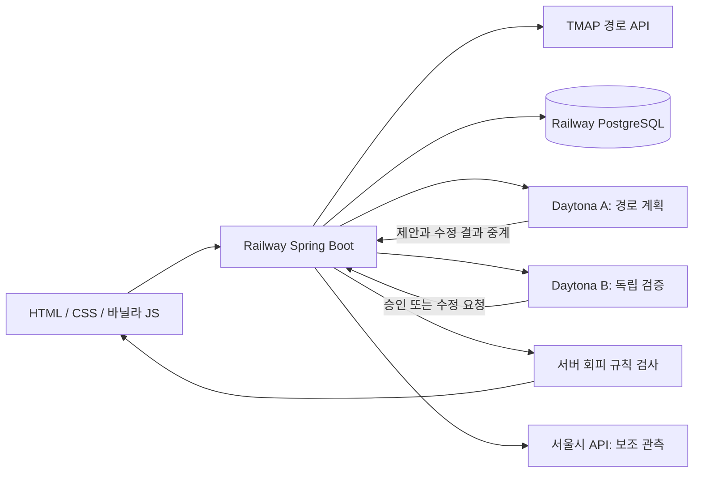

# 출근지킴이 — 구간 장애에 대응하는 대안 경로 안내

2026-09-18 최종 요구사항 반영. 해커톤 발표 목표: 2026-09-19.

## 핵심 목표

**출발지에서 목적지까지 가는 버스·지하철 경로를 안내하고, 이용할 수 없는 구간이 생기면 그 구간을 피하는 후보를 제시한다.** 사고나 지연의 자동 탐지가 필수 선행 조건은 아니다. 공사·통제·운행 중단·이용 불가·개인 선택을 내 검색의 회피 조건으로 입력할 수 있다.

발표 문장: “TMAP 경로를 받은 뒤 막힌 구간을 선택하면, 경로 계획 에이전트와 검증 에이전트가 서로 확인하며 다음 이동 경로를 제안합니다.”

## 사용자 흐름

1. 출발·도착지 선택. 강남·역삼·선릉 주변 프리셋 또는 국내 WGS84 좌표 직접 입력.
2. TMAP에서 최대 10개 후보를 조회한다. 지하철·버스·도보 구간, 환승, 예상 시간, 요금을 표시한다.
3. 경로의 버스·지하철 구간에서 `이 구간 피하기`를 누른다. 회피 범위는 선택한 승차 구간 양방향 또는 노선 전체다.
4. 에이전트 A가 후보를 비교한다. B가 정류장·노선·운행 시간표를 독립적으로 검사하고 잘못된 제안이면 A에 수정을 요청한다.
5. 서버가 최종 추천을 다시 검사한다. 만족하는 후보 중 시간 → 환승 → 도보 순으로 선택한다. 기본 최단 후보 대비 추가 예상 시간을 함께 표시한다.
6. 회피 조건을 추가하거나 해제하면 다시 비교한다. 모두 막히거나 구간 정보가 부족하면 대안이 없다고 안내한다.

## 경로 데이터와 장애 정보의 분리

- TMAP: 경로 후보와 예상 소요시간. `service`는 요청 시각 기준 운행 시간표이며 실제 사고·고장 센서가 아니다.
- 사용자 입력: 해당 검색 세션에만 적용하는 회피 조건. 공식 장애·사고로 게시하지 않는다.
- 서울시 API: 기존 운행 대시보드의 열차 위치·도착 관측 및 지연 의심 알림에 사용한다. 경로 검색 자체에는 서울시 키가 필요 없다.
- 합성 시연: 실제 노선이 아닌 `시연 버스 A/B`, `시연 2호선`과 합성 시간을 사용한다. TMAP 실패를 합성 경로로 조용히 대체하지 않는다.

현재 서울시의 의심 판정은 보조 화면에 표시하며 경로를 자동 차단하지 않는다. 사용자가 해당 경로의 회피 조건으로 반영한다. 자동 반영·공식 운행 공지 수집·다른 사용자 제보의 검증/공유는 후속 범위다.

## 구현 아키텍처

- Java 21 / Spring Boot 4.1.1. 프런트엔드 프레임워크 없음.
- A와 B는 각각 독립된 Python HTTP worker. `read_routes`, `check_avoidance`, `submit_route`를 OpenAI Responses API 함수 도구로 사용한다.
- 기존 관측 도구도 제공한다. `read_observations`, `check_freshness`, `request_refresh`, `submit_decision`.
- 통신은 Spring 중계 + Daytona private preview + 서비스 인증 토큰. 브라우저에 API 키/preview token을 내려주지 않는다.
- DB에는 구독·알림·관측·호출 예산이 저장된다. 에이전트에 DB를 별도로 두지 않는다.
- 경로 응답과 회피 세션은 서버 메모리에만 저장하고 5분 후 사용을 중단한다. 재배포하면 다시 검색해야 한다.
- 키 없는 상태에서는 규칙 검사/합성 시연을 명시한다. 실제 OpenAI가 호출된 것처럼 표시하지 않는다.

## 구간 회피 규칙

- TMAP `routeId`, 지하철 `type`, 노선명으로 같은 노선을 식별한다.
- `passStopList.stationList`의 연속 정류장 쌍을 비교한다. 장애 구간의 역방향도 제외한다.
- 버스 구간 장애는 같은 정류장 쌍을 통과하는 다른 버스 노선에도 적용한다. 노선 전체 회피를 선택하면 그 노선만 제외한다.
- 통과 정류장 정보가 부족하면 해당 이동수단 후보의 회피 여부를 확인할 수 없으므로 보수적으로 제외한다.
- 응답에 없는 경로, 노선, 요금, 장애 원인, 복구 예정 시각을 LLM이 만들 수 없다.
- 후보가 없으면 `NO_ALTERNATIVE`, AI 응답 오류/지연이면 `VERIFY_PENDING`. 제외된 경로를 AI의 말만으로 승인하지 않는다.
- 지도상의 도로 통제 영역이나 실제 안전을 판정하는 시스템은 아니다. 입력한 승차 구간과 API의 정류장 정보를 비교하는 MVP다.

## 범위와 한계

- TMAP에 없는 후보를 새로 생성하거나 별도 그래프 라우터로 재탐색하지 않는다. TMAP 요청에 존재하지 않는 `avoid` 옵션을 가정하지 않는다.
- 따라서 “도시 전체에서 가능한 우회로가 없다”가 아니라 “반환된 후보에서 대안을 찾지 못했다”로 표현한다.
- 장소명 자동검색/지도 SDK, 사용자 계정, 실시간 버스 도착, 턴 안내, 장애 제보 공유는 후속 기능이다.
- 알림은 기존 지하철 의심 징후에 대해 웹/페이지가 열린 브라우저에서 제공한다. 백그라운드 Web Push/SMS는 미구현이다.

## 해커톤 시연

1. 첫 화면에서 `강남 → 선릉`, `시연 · 합성 경로` 선택 → 경로 찾기.
2. 최초 추천은 시연 지하철 12분.
3. 시연 2호선 구간 피하기 → 겹치는 혼합 후보도 제외 → 시연 버스 A 20분, +8분.
4. 버스 A 구간 피하기 → 별도 구간의 시연 버스 B 27분, +15분.
5. 버스 B도 피하기 → 대안 없음. 회피 조건 해제 → 추천 복구.
6. Daytona/OpenAI 연결 후 우측 A/B 도구 실행 및 독립 검증 기록 확인.
7. 보조 시연: 역삼/내선 구독 → 지연 징후 시연 → 재조회와 중복 없는 알림 확인.

[키 발급](KEYS.md) · [배포 절차](DEPLOY.md) · [실제 배포 상태](STATUS.md)
