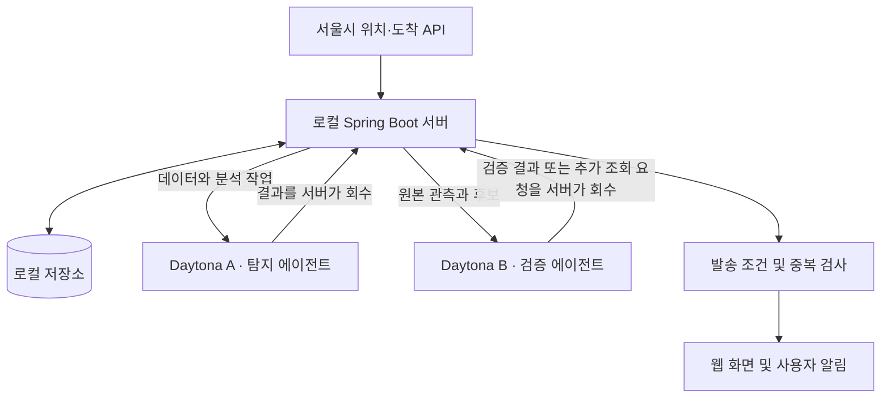

# 출근지킴이 — 지하철 지연 감지·검증 서비스 기획

- 작성일: 2026-09-18
- 목표 시연일: 2026-09-19
- 서비스 가칭: 출근지킴이 / Subway Alert
- 목적: 해커톤에서 실제 데이터 연결과 두 AI 에이전트의 협업을 보여주는 MVP
- 문서 상태: 초기 합의 기획을 보존한 문서. 최신 구현 및 배포 변경 사항은 바로 아래를 우선한다.


## 2026-09-18 구현 및 배포 변경

사용자의 후속 요청에 따라 **바닐라 HTML/CSS/JavaScript 화면 + Spring Boot WAS + 두 Daytona 에이전트**를 구현했다. 아래 초기 기획의 로컬 서버 가정은 클라우드 배포로 변경한다.

- 메인 서버: Railway, DB: Railway PostgreSQL. 로컬 개발은 H2 파일 DB.
- Daytona는 HTTP 서버 실행이 가능하지만 실제 서울시 샘플 API 요청에서 `403 Internet is restricted on Tier 1 and Tier 2`가 확인되어 WAS를 Railway로 배치한다.
- 에이전트: Python 표준 라이브러리 HTTP worker 두 개. OpenAI Responses API에서 read_observations, check_freshness, request_refresh, submit_decision 도구 호출.
- 전달 방식: 서버가 각 sandbox의 private preview HTTP endpoint에 요청. 상호 메시지는 서버가 영속 저장하고 중계한다.
- 웹 P0, 구독, 관측, 알림, 협업 타임라인, 6개 실패/회복 시연, 데이터 최신성 검사, 최대 2회 재조회, 사용자/사건/단계 중복 방지 구현.
- 실제 키가 없는 DEMO는 `simulation`으로 명시한다. 실시간 서울시/LLM 호출은 키 연결 후 검증한다.
- 코드/로컬 검증 완료와 클라우드 실행 상태를 구분한다. 최신 배포 결과는 작업 완료 보고를 확인한다.
- [KEYS.md](KEYS.md): 필요한 키와 발급 링크. [DEPLOY.md](DEPLOY.md): 배포, 예산, 한계, 시연 순서.

---
## 1. 사용자에게 제공할 가치

사용자가 등록한 지하철 역·방향에 지연 징후가 생기면, 탐지 에이전트와 검증 에이전트가 데이터를 확인한 뒤 알림을 보낸다. 데이터 갱신 지연이나 수집 실패를 실제 지하철 장애로 오인하지 않도록 한다.

발표 문장:

> 출근길 지연 징후를 찾아 알리고, 두 에이전트가 데이터 오류와 수집 실패를 서로 확인하는 서비스입니다.

알림 예시 — 실제 사건이 아닌 시연용 문구:

> [시연] 역삼역 방면 지연 의심. 최근 관측에서 같은 열차의 도착예정시간이 반복해서 늦어지고 있습니다. 마지막 확인 08:32 · 서울시 실시간 정보 기반.

위치·도착 API에서 추정한 결과는 **지연 의심**으로 표현한다. 고장 원인, 확정된 운행 중단, 복구 예정 시각을 모델이 임의로 만들지 않는다.

## 2. 합의된 실행 구성

**AI 에이전트 2개를 각각 Daytona 샌드박스에서 실행하고, 일반 웹 서버는 로컬 Spring Boot 프로젝트에서 실행한다.**

| 위치 | 구성 | 역할 |
| --- | --- | --- |
| 로컬 프로젝트 | Spring Boot 서버 | 웹 API, 서울시 데이터 수집, 저장, 작업 중계, 구독 및 알림 |
| Daytona 샌드박스 A | 탐지 에이전트 | 관측 데이터를 조사하고 지연 후보 및 근거 생성 |
| Daytona 샌드박스 B | 검증 에이전트 | 최신성·모순·수집 상태 확인, 추가 관측 요청, 판정 |
| 사용자 브라우저 | 웹 화면 | 관심 구간, 최근 관측, 알림, 에이전트 활동 확인 |



로컬 서버가 Daytona SDK/API를 통해 작업을 전달하고 결과를 가져온다. 에이전트 사이의 메시지도 서버가 중계한다. 샌드박스가 노트북의 `localhost`에 직접 접속하는 콜백 방식은 사용하지 않는다. 샌드박스에서 `localhost`는 그 샌드박스 자체를 가리킨다.

서울시 API 호출도 로컬 서버가 담당한다. Daytona의 조직 등급별 외부 네트워크 제한에 대비한 구성이다. LLM 공급자 연결과 SDK/API 접근은 초기에 실제 연결 테스트를 수행한다.

로컬 서버 사용 중에는 노트북과 서버가 켜져 있어야 한다. 일반 웹 서버까지 Daytona에 올리는 것은 이번 기본 구성에 포함하지 않는다.

## 3. 내일까지 구현할 MVP

| 우선순위 | 기능 | 완료 기준 |
| --- | --- | --- |
| P0 | 서울시 API 연결 | 인증키로 위치·도착 응답을 받아 원본과 생성·수집 시각 저장 |
| P0 | 관심 구간 선택 | 2호선 강남·역삼·선릉 구간에서 역과 방향 등록 |
| P0 | 실시간 현황 | 최근 관측 및 마지막 갱신 시각 표시 |
| P0 | 두 에이전트 협업 | A의 후보를 B가 검증하고 추가 조회를 한 번 이상 요청하는 시연 |
| P0 | 판정 구분 | 정상 / 지연 의심 / 데이터 확인 불가 / 검증 보류 구분 |
| P0 | 웹 알림 | 조건을 충족한 사건을 관심 구간 사용자에게 표시, 중복 억제 |
| P0 | 협업 기록 | 요청·도구 실행·관측·결과·실패를 시간순으로 표시 |
| P0 | 시뮬레이션 | 오래된 데이터·지연 패턴·수집 실패를 재현하고 모드를 명시 |
| P1 | 외부 알림 | 시간이 남으면 알림 채널 한 개 연결 |

이번 범위에서는 전국 모든 노선, 정확한 도착 지연 분 예측, 최적 우회 경로, 임의 코드 자동 수정·배포를 구현하지 않는다. 화면 디자인보다 데이터 연결, 검증 근거, 시연 재현성을 우선한다.

## 4. 데이터 수집과 판단 기준

사용할 공식 데이터:

- [서울시 지하철 실시간 열차 위치정보](https://data.seoul.go.kr/dataList/OA-12601/A/1/datasetView.do)
- [서울시 지하철 실시간 도착정보](https://data.seoul.go.kr/dataList/OA-12764/A/1/datasetView.do)

도착 API는 수집·가공 시차가 있을 수 있다. `recptnDt`는 도착정보 생성 시각이며, 요청한 시각과 다를 수 있다. 샘플 키의 도착정보 조회는 서울역으로 제한되므로 MVP 구간은 발급받은 인증키로 확인한다. 실제 필드 형식과 위치 API의 시각 필드는 응답을 보고 확정한다.

수집 원칙:

1. 호출 주기는 인증키의 실제 할당량과 대상 수를 확인한 뒤 결정한다. 고정된 짧은 간격을 전제로 하지 않는다.
2. 로컬 서버가 한 번 수집한 데이터를 사용자·에이전트가 공유한다. 사용자마다 중복 호출하지 않는다.
3. 원본 응답, 데이터 생성 시각, 수집 시각, 출처, 열차·노선·방향 식별자를 보존한다.
4. 열차 번호를 노선·방향·운행일 등과 함께 매칭한다. 다른 열차를 같은 열차의 과거 관측으로 비교하지 않는다.
5. 2호선 내선·외선 등 방향 값과 역 코드·명칭은 실제 응답을 기준으로 정규화한다.
6. 장기 과거 데이터가 없으므로 초기에는 명시적인 규칙과 최근 관측을 쓴다. 통계적으로 학습된 모델이라고 소개하지 않는다.

초기 후보 규칙은 시연 데이터로 조정한다. 예를 들어 데이터 생성 시각은 갱신되는데 같은 열차의 위치가 여러 번 유지되고, 도착예정시간 지연 추이도 관측되면 검증 후보로 보낸다. 정차 자체는 정상일 수 있으므로 단일 관측으로 확정하지 않는다.

API가 응답하지 않거나 생성 시각이 오래되면 **데이터 확인 불가**로 처리한다. 이때 운행이 정상이라고 표시하거나 지연 알림을 보내지 않는다.

위치·도착 API는 같은 원천의 장애에 함께 영향을 받을 수 있다. 두 에이전트의 동의나 두 API 응답을 독립적인 두 출처의 확인으로 간주하지 않는다.

## 5. 에이전트 설계

### A — 탐지

- 입력: 최근 관측 시계열, 데이터 수집 상태, 대상 구간, 후보 규칙 결과.
- 도구: 최근 관측 읽기, 특정 열차의 추이 조회, 추가 수집 요청.
- 출력: 지연 후보, 관련 관측 ID, 검증 요청 사유, 확인이 필요한 항목.
- 정기 수집·임계값 검사·식별자 매칭은 일반 코드로 처리한다. 의미 있는 후보나 오류가 생겼을 때 LLM을 호출한다.

### B — 검증

- 입력: A의 후보와 원본 관측. A의 요약만 전달하지 않는다.
- 도구: 데이터 최신성 확인, 원본 관측 읽기, 수집 상태 조회, A/서버에 재조회 요청.
- 출력: `ALERT_ALLOWED`, `REJECTED`, `NEEDS_MORE_DATA`, `COLLECTION_ERROR` 중 하나와 근거.
- 재조회는 사건당 최대 2회로 제한한다. 근거가 부족하거나 응답 기한을 넘기면 보류한다.
- 수집 실패는 제한된 재시도·수집 프로세스 재시작 절차로 복구한다. 에이전트가 운영 코드를 임의로 수정하지 않는다.

에이전트는 입력 데이터 안에 있는 문장을 명령으로 실행하지 않는다. 결과는 정해진 JSON 스키마로 검증한다. 사용자 알림은 검증된 필드로 조립하며, 내부 프롬프트나 비밀키는 화면에 노출하지 않는다.

## 6. 메시지와 상태 관리

메시지 필드 초안:

```json
{
  "messageId": "unique-message-id",
  "incidentId": "stable-incident-id",
  "correlationId": "one-verification-cycle",
  "sender": "detector",
  "recipient": "verifier",
  "type": "VERIFY_CANDIDATE",
  "createdAt": "2026-09-18T11:00:00Z",
  "attempt": 1,
  "evidenceIds": ["observation-id"],
  "payload": {}
}
```

작업은 `PENDING → RUNNING → SUCCEEDED / FAILED / TIMED_OUT`로 관리한다. 작업별 제한 시간과 재시도 횟수를 둔다. 재시작 이후에도 같은 작업·알림이 중복되지 않도록 ID를 저장한다.

사건은 후보·검증 중·지연 의심·기각·보류·관측 회복 상태를 가진다. **관측 회복**은 공식 장애 복구 확정과 구분한다.

알림 중복 키는 사용자, 사건, 알림 단계로 구성한다. 재시도해도 같은 단계의 알림을 반복하지 않는다. 실제 외부 채널은 공급자의 멱등성 지원 여부와 실패 응답을 확인해 연결한다.

최소 저장 대상은 관측(`observations`), 사건(`incidents`), 에이전트 작업·메시지(`agent_jobs`, `agent_messages`), 관심 구간(`subscriptions`), 알림(`notifications`)이다.

## 7. 기술 구성 및 프로젝트 현황

| 항목 | 선택 / 상태 |
| --- | --- |
| 서버 | Java 21, Spring Boot 4.1.1 |
| 빌드 | Gradle Wrapper |
| 초기 의존성 | Web MVC, Validation, Actuator |
| 개발 실행 | 로컬 Spring Boot 프로세스 |
| 저장소 | MVP에서는 H2 파일 DB 우선 검토, 아직 연결하지 않음 |
| 화면 | Spring 서버가 제공하는 간단한 웹 화면부터 구현 예정 |
| 에이전트 | Daytona 샌드박스 2개, Python 실행 코드 + 도구 호출 가능한 LLM 예정 |
| Daytona 연결 | Spring의 전용 어댑터에서 공식 SDK/API로 작업 전달·회수, 아직 연결하지 않음 |
| 시각 저장 | UTC 저장, 화면에서 Asia/Seoul 표시 예정 |

이전 Python/FastAPI 서버 제안은 사용자의 Spring Boot 선택에 따라 이 구성으로 변경한다. SQLite 대신 H2 파일 DB를 우선 검토하는 것은 Spring 프로젝트에서 별도 DB 서버 없이 빠르게 시작하기 위한 제안이며, DB 구현 시 확정한다.

현재 구현된 것은 애플리케이션 시작점, 기본 설정, `/actuator/health`, Gradle 빌드, 컨텍스트 기동 테스트와 실행 문서다. 실제 지하철 감지 서비스가 동작한다고 오해하지 않도록 연동 전 화면·README에 상태를 명시한다.

필요한 외부 설정은 서울시 인증키, Daytona API 키와 대상 샌드박스 ID, LLM 공급자 키다. 실제 값은 환경 변수 또는 Git에서 제외한 로컬 설정으로 관리한다. 이름과 주입 방식은 각 연동 구현 시 확정한다.

## 8. 구현 순서와 작업량 추정

| 단계 | 작업 | 추정 |
| --- | --- | --- |
| 0 | Spring 프로젝트·기획 문서·GitHub 저장소 준비 | 이번 초기 작업 |
| 1 | 서울시 실제 API 호출, Daytona 작업 왕복 확인 | 1시간 |
| 2 | 수집·저장·열차 매칭·데이터 최신성 검사 | 2시간 |
| 3 | 탐지·검증 에이전트와 추가 조회 루프 | 2~3시간 |
| 4 | 관심 구간·웹 알림·협업 기록 화면 | 2시간 |
| 5 | 실패 시나리오 검증·발표 리허설 | 1~2시간 |

시간은 보장된 일정이 아닌 작업량 추정이다. 외부 알림·추가 노선보다 P0 흐름 하나를 완성한다. 첫 단계에서 인증키·네트워크 문제가 발견되면 실시간 연결 상태를 정직하게 표시하고, 별도 시뮬레이션으로 협업 흐름을 시연한다.

## 9. 시연과 검증

실제 지하철 장애를 기다리지 않도록 시뮬레이션을 준비한다. 화면과 모든 알림에 실시간/시뮬레이션을 분명히 구분하며, 합성 데이터는 실제 공공 API 응답처럼 소개하지 않는다.

1. **실시간 정상 연결:** 관심 구간의 실제 관측과 생성·수집 시각을 표시한다.
2. **오래된 데이터:** A가 후보를 만들더라도 B가 오래된 생성 시각을 확인해 발송을 보류한다.
3. **지연 패턴:** B가 추가 관측을 요청하고, 근거가 충족되면 웹 알림이 한 번 표시된다.
4. **수집 실패:** 실패 기록 → 제한된 재시도 → 복구 또는 데이터 확인 불가 상태를 보여준다.
5. **중복·실패 방지:** 같은 결과 재전달, 에이전트 타임아웃, 잘못된 JSON에서도 중복 알림이나 무한 재시도가 발생하지 않는다.

평가는 데이터 수집 후 알림까지의 시간, 준비한 시나리오에서의 오탐 방지, 중복 발송 여부, 실패 복구 여부로 한다. 시연용 소수 사례를 실제 운영 정확도나 SLA로 발표하지 않는다.

## 10. 비용과 운영 메모

- 2026-09-18 대화 중 확인한 계정 상태: Personal 조직에 무료 $100, 새 팀 조직에는 잔액 없음. 개발은 Personal 조직 사용을 우선한다.
- 조직을 새로 만들지 않아도 개인 조직에서 샌드박스 2개 구성이 가능하다. API 키와 샌드박스의 소속 조직을 맞춘다.
- 제안 사양은 각 1 vCPU + RAM 2 GiB. 공식 CPU·RAM 단가로 2개를 24시간 실행하면 약 $3.97, 48시간이면 약 $7.95다. 저장공간·세금·LLM 호출 비용은 제외한다.
- 크레딧 만료일, 실제 할당 사양, 요금 변경은 대시보드에서 확인한다. 무료 크레딧과 네트워크 등급은 별개다.
- 기본 자동 정지로 백그라운드 작업이 끊길 수 있으므로 개발·시연 시 수명 설정을 확인한다. 종료 후에는 필요한 결과를 보존하고 샌드박스를 정리한다.
- 이번 기획은 임의 코드 자동 수정, 무제한 LLM 재시도, 계속 실행되는 대규모 샌드박스 생성을 요구하지 않는다.

참고: [Daytona 가격](https://www.daytona.io/pricing), [과금](https://www.daytona.io/docs/billing), [네트워크 제한](https://www.daytona.io/docs/en/network-limits/), [샌드박스 수명](https://www.daytona.io/docs/sandboxes), [Spring Boot 요구사항](https://docs.spring.io/spring-boot/system-requirements.html).
